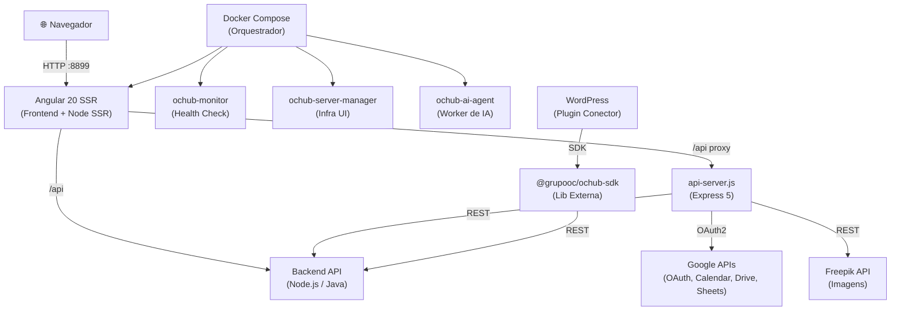
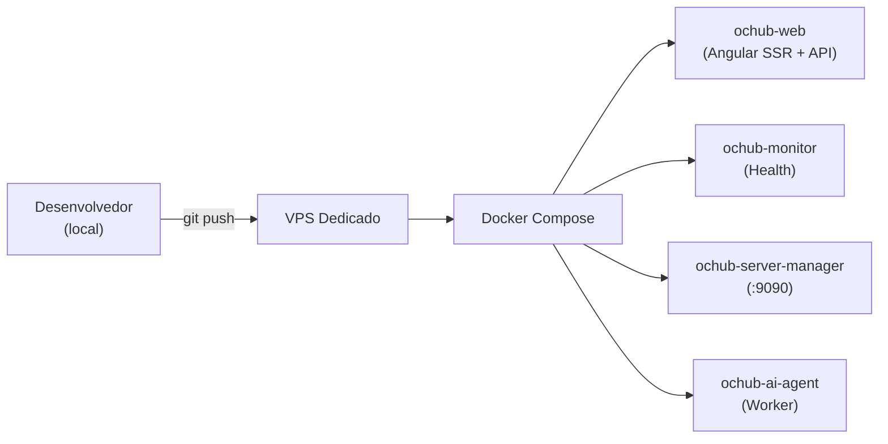

# Arquitetura do OcHub

## Visão Geral

O OcHub é estruturado como um **monorepo híbrido** que combina um frontend Angular com SSR, uma API Express de suporte e serviços auxiliares containerizados. A escolha por SSR (Server-Side Rendering) foi motivada pela necessidade de performance inicial e renderização de dashboards pesados no lado servidor.

---

## Diagrama de Componentes

---

## Decisões Arquiteturais

### 1. Angular SSR com Express embutido
**Decisão:** Usar `@angular/ssr` com Express como adaptador ao invés de um SPA puro.
**Justificativa:** Permite renderização inicial no servidor para dashboards com muitos dados, melhora o tempo de carregamento percebido e facilita a hospedagem em um único contêiner Docker.

### 2. API Companion (api-server.js)
**Decisão:** Manter uma API Express separada da lógica do Angular SSR.
**Justificativa:** Separa responsabilidades — o SSR cuida de renderização, enquanto a API gerencia operações longas (auditorias de site, cron jobs de marketing, geração de imagens via Freepik, webhooks de IA).

### 3. Backend API com Node.js e Java
**Decisão:** Utilizar uma API backend dividida entre serviços Node.js (operações em tempo real, integrações, cron jobs) e Java (regras de negócio críticas, processamento pesado).
**Justificativa:** Permite separar responsabilidades por domínio de performance — Node.js para I/O intensivo e APIs de integração; Java para processamento transacional e lógica de negócio robusta.

### 4. Feature-based Module Structure
**Decisão:** Organizar o frontend em módulos por feature (`src/app/features/`).
**Justificativa:** Cada feature (CRM, OS, Marketing, etc.) é lazy-loaded independentemente, reduzindo o bundle inicial e isolando a lógica de domínio.

### 5. SDK Próprio (@grupooc/ochub-sdk)
**Decisão:** Publicar um SDK TypeScript separado para integrações externas.
**Justificativa:** Permite que sistemas terceiros (como WordPress) se integrem ao OcHub sem acesso direto ao código-fonte. O SDK encapsula chamadas à API backend com tipos seguros.

### 6. RAG Local para Contexto de IA
**Decisão:** Indexar o codebase localmente com embeddings (via `@xenova/transformers`).
**Justificativa:** Permite que agentes de IA consultem o contexto do projeto sem enviar código para APIs externas, preservando confidencialidade.

---

## Padrões Utilizados

| Padrão | Onde é aplicado |
|---|---|
| Feature Module | `src/app/features/*` |
| Lazy Loading | Todas as rotas principais |
| Route Guard | `core/guards/auth.guard.ts` |
| HTTP Interceptor | `core/interceptors/global-error.interceptor.ts` |
| Repository Pattern | Services de cada feature (via API REST) |
| Observer/Reactive | RxJS em todos os services |
| Strategy | Preloading de rotas navbar |
| Cron / Scheduler | `node-cron` na API para jobs de marketing |

---

## Infraestrutura de Deploy

**Limites de memória por container:**
- `ochub-web`: 1.5 GB RAM
- `ochub-server-manager`: 512 MB RAM
- `ochub-monitor`: 256 MB RAM
- `ochub-ai-agent`: 512 MB RAM / 0.5 CPU
