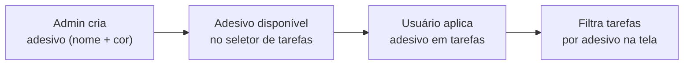

# Módulo: Adesivos (Stickers)

> **Rota:** `/crm/stickers` | **Módulo ID:** `crm.stickers` | **Ícone:** `tag`

## Responsabilidade

CRUD de etiquetas coloridas (`CrmAdesivo`) usadas para categorizar, classificar e filtrar tarefas visualmente. Um adesivo é uma tag com nome e cor que pode ser aplicada a uma ou mais tarefas simultaneamente.

---

## Padrão Arquitetural

**Simple Service** — `StickerService` expõe `getStickers()` com cache opcional. O relacionamento tarefa↔adesivo é M2M via tabela junction. A aplicação e remoção de adesivos ocorre dentro do `TaskFormComponent`.

---

## Entidades

| Campo | Tipo | Descrição |
|---|---|---|
| `id` | string | Identificador único |
| `nome` | string | Nome exibido na UI |
| `cor` | string | Código hexadecimal da cor |
| `ativo` | boolean | Se o adesivo está disponível para uso |

---

## Fluxo de Uso

---

## Como Adesivos são usados nas Tarefas

1. **Aplicação:** dentro do `TaskFormComponent`, dropdown multi-select de adesivos disponíveis
2. **Persistência:** salvos via M2M junction na API
3. **Filtragem:** `TasksPageComponent` filtra `tasks()` pelo `Set<string>` de IDs selecionados
4. **Display:** chips coloridos nos cards Kanban quando "Bolhas" está ativo

---

## Pontos Fortes

- ✅ Categorização visual rápida sem alterar dados da tarefa
- ✅ Filtro multi-select por adesivo na página de tarefas
- ✅ Inicialização com todos os adesivos selecionados (zero configuração inicial)

## Sugestões de Melhoria

- 🔧 Adesivos com ícone além de cor para acessibilidade
- 🔧 Contagem de tarefas por adesivo no CRUD
- 🔧 Adesivos favoritos por usuário para acesso rápido

---

## Relevância para Portfolio: ⭐⭐⭐ (3/5)
