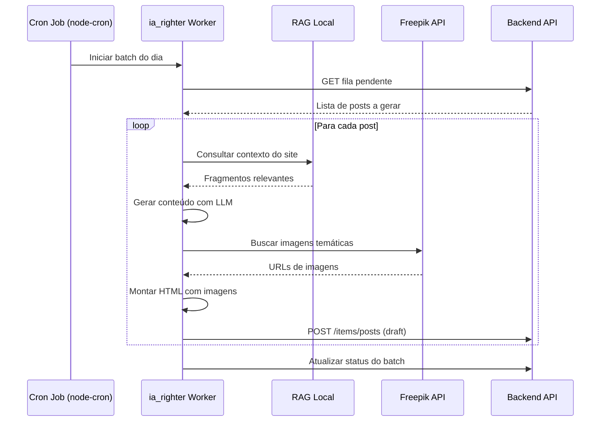

# Módulo: Agentes de IA (ai-agents)

## Overview

O módulo AI Agents provê uma interface visual para interagir, monitorar e configurar os agentes de IA que operam no ecossistema OcHub. Inclui o worker de geração editorial (`ia_righter`), pipelines de conteúdo e o sistema RAG (Retrieval-Augmented Generation) para contextualização do projeto.

**Por que existe:** A equipe precisava de visibilidade sobre o que os agentes de IA estavam gerando, com capacidade de intervir, reprovar ou redirecionar saídas sem acessar o terminal do servidor.

---

## Entidades Principais

| Entidade | Tipo | Atributos Públicos |
|---|---|---|
| `AgentRun` | model | nome_agente, status, inicio, fim, resultado |
| `ContentQueue` | model | site_id, quantidade, status, data_agendada |
| `GeneratedPost` | model | titulo, site, status, score_qualidade, modelo_ia |

> Campos omitidos: prompts internos com lógica proprietária, configurações de temperatura e parâmetros de modelo.

---

## Arquitetura do Sistema IA

```mermaid
graph TD
    UI["Interface Angular\nai-agents module"]
    APIServer["api-server.js\n/api/ai-agent/*"]
    IAWorker["ia_righter\n(Worker isolado)"]
    RAG["Sistema RAG\nEmbeddings locais"]
    Backend API["Backend API\n(Fila de conteúdo)"]
    Freepik["Freepik API\n(Imagens automáticas)"]
    DockerAI["Container\nochub-ai-agent"]

    UI -->|"REST"| APIServer
    APIServer -->|"Controle"| IAWorker
    IAWorker -->|"Consulta contexto"| RAG
    IAWorker -->|"Publica draft"| Backend API
    IAWorker -->|"Busca imagens"| Freepik
    DockerAI -.->|"Executa"| IAWorker
```

---

## Fluxo: Geração Automática de Conteúdo



---

## Padrão Arquitetural

**Worker + Queue Pattern** — O `ia_righter` consome uma fila de tarefas pendentes no Backend API. Cada item da fila representa um post a ser gerado para um site específico. O resultado vai como rascunho para revisão humana antes de publicação.

---

## Pontos Fortes

- ✅ Isolamento do worker de IA em container dedicado com limite de CPU/RAM
- ✅ Sistema RAG local preserva confidencialidade (sem envio de código para APIs externas)
- ✅ Fila de tarefas no CMS cria auditabilidade completa do que foi gerado e quando

---

## Sugestões de Melhoria

- 🔧 Dashboard em tempo real do progresso do batch via WebSocket
- 🔧 Score de qualidade automático (gramática, originalidade, SEO) antes de salvar draft
- 🔧 Retry automático com prompt diferente para posts que falharam na revisão humana

---

## Relevância para Portfolio: ⭐⭐⭐⭐⭐ (5/5)

Sistema de IA em produção com arquitetura de worker isolado, sistema RAG local, pipeline de revisão humana e publicação automatizada. Alto diferencial técnico para recrutadores de produtos de IA.
