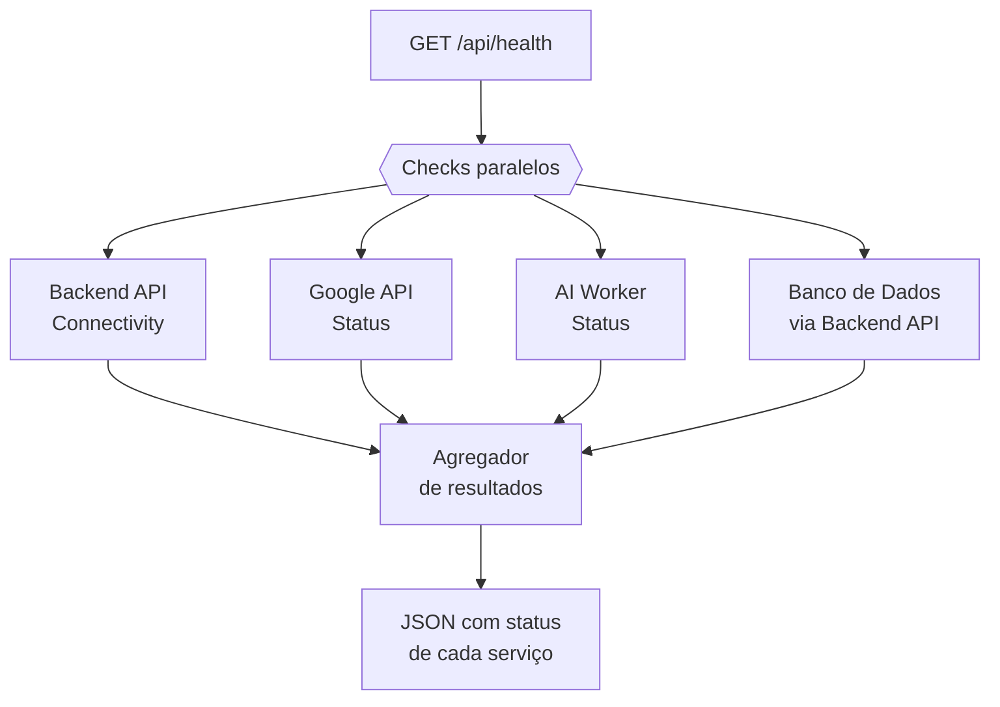
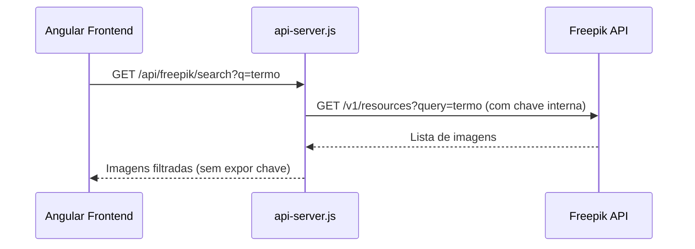

# Módulo: api-server (API Companion Express)

## Overview

O `api-server.js` é o backend companion da aplicação Angular SSR. Enquanto o Angular SSR serve o frontend e faz proxy das requisições Backend API, a API Express complementa com operações que requerem execução server-side longa: cron jobs, auditoria de sites, geração de imagens, streaming de logs e health check centralizado.

**Por que existe:** Certas operações não podem ser feitas diretamente pelo frontend por questões de CORS, proteção de credenciais (como a chave Freepik) ou porque requerem tempo de execução superior ao timeout de uma requisição SSR.

---

## Grupos de Endpoints

| Grupo | Prefixo | Responsabilidade |
|---|---|---|
| Saúde | `/api/health` | Status de todos os serviços e conectividade |
| Marketing | `/api/marketing/*` | Status de sites, agendamento de conteúdo |
| Auditoria | `/api/site-audit/*` | Análise SEO e rastreamento de sites |
| Logs | `/api/logs` | Leitura e escrita de logs da aplicação |
| Integrações | `/api/integrations/*` | Status e callbacks OAuth |
| AI Agent | `/api/ai-agent/*` | Controle e status do worker de IA |
| Imagens | `/api/freepik/*` | Proxy para busca de imagens (protege chave API) |

---

## Fluxo: Health Check Completo

---

## Fluxo: Proxy Freepik (Proteção de Chave)

---

## Padrão Arquitetural

**API Gateway leve** — A API não tem ORM, não tem autenticação própria (herda do token Backend API passado pelo frontend), e atua principalmente como gateway/proxy para serviços externos e operações longas. Usa `node-cron` para jobs agendados internamente.

---

## Configuração de Runtime

| Variável de Ambiente | Valor Padrão | Efeito |
|---|---|---|
| `API_PORT` | `3001` | Porta de escuta |
| `SITE_AUDIT_MAX_URLS` | `80` | Limite de URLs por auditoria |
| `SITE_AUDIT_BATCH_SIZE` | `3` | URLs analisadas em paralelo |
| `AI_AGENT_MAX_RUNTIME_MS` | `900000` | Timeout do worker de IA (15min) |

---

## Pontos Fortes

- ✅ Proxy de credenciais protege chaves sensíveis do frontend
- ✅ Health check unificado facilita monitoramento de toda a stack
- ✅ Cron jobs integrados eliminam necessidade de infraestrutura de filas externa

---

## Sugestões de Melhoria

- 🔧 Adicionar autenticação própria nos endpoints de admin (rate limiting + API key)
- 🔧 Separar cron jobs em workers independentes para melhor isolamento de falhas
- 🔧 Implementar circuit breaker para chamadas a serviços externos

---

## Relevância para Portfolio: ⭐⭐⭐⭐ (4/5)

API Express complementar com múltiplos domínios (saúde, marketing, auditoria, proxy), demonstrando capacidade de arquitetar backends pragmáticos que resolvem problemas reais de integração.
