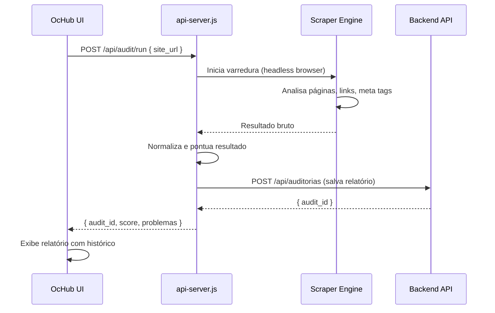

# Módulo: Auditoria de Sites

> **Rota:** `/marketing/site-audit` | **Permissão:** mesma de `marketing.seo` | **Ícone:** `shield-check`

## Responsabilidade

Varredura técnica completa de sites WordPress gerenciados pelo grupo. Analisa estrutura, performance, SEO on-page, links quebrados, meta tags e acessibilidade de forma automatizada, gerando relatórios históricos por site para acompanhamento de evolução.

---

## Padrão Arquitetural

**Scheduled Scraper + Report Storage** — o `api-server.js` executa as auditorias via cron job agendado (ou sob demanda). O resultado é persistido na API backend para consulta histórica. O Angular exibe os relatórios sem re-executar a auditoria.

---

## O que é auditado

| Categoria | Verificações |
|---|---|
| **SEO On-Page** | Title tag, meta description, H1, canonical, robots.txt, sitemap.xml |
| **Performance** | Tamanho da página, número de requests, tempo de resposta |
| **Links** | Links quebrados (4xx/5xx), redirecionamentos em cadeia |
| **Imagens** | Alt text ausente, imagens sem compressão, formatos legados |
| **Estrutura** | Schema markup, Open Graph, estrutura de headings |
| **Segurança** | HTTPS ativo, certificado válido, headers de segurança |

---

## Fluxo de Auditoria



---

## Estrutura do Relatório

```typescript
interface AuditReport {
  site_id: string;
  site_url: string;
  data_auditoria: string;
  score_geral: number;       // 0-100
  score_seo: number;
  score_performance: number;
  score_acessibilidade: number;
  problemas: {
    tipo: string;
    severidade: 'critico' | 'aviso' | 'info';
    descricao: string;
    url_afetada?: string;
    recomendacao: string;
  }[];
  historico: AuditSummary[];  // Últimas N auditorias para comparativo
}
```

---

## Pontos Fortes

- ✅ Auditoria automatizada — sem necessidade de ferramentas externas pagas
- ✅ Histórico de auditorias para acompanhar evolução do score
- ✅ Relatório acionável com recomendações específicas por problema
- ✅ Roda via `api-server.js` — não sobrecarrega o Angular SSR

## Sugestões de Melhoria

- 🔧 Agendamento automático de auditoria semanal por site
- 🔧 Alertas quando score cai abaixo de threshold configurado
- 🔧 Comparativo automático com última auditoria em formato diff visual

---

## Relevância para Portfolio: ⭐⭐⭐⭐⭐ (5/5)
