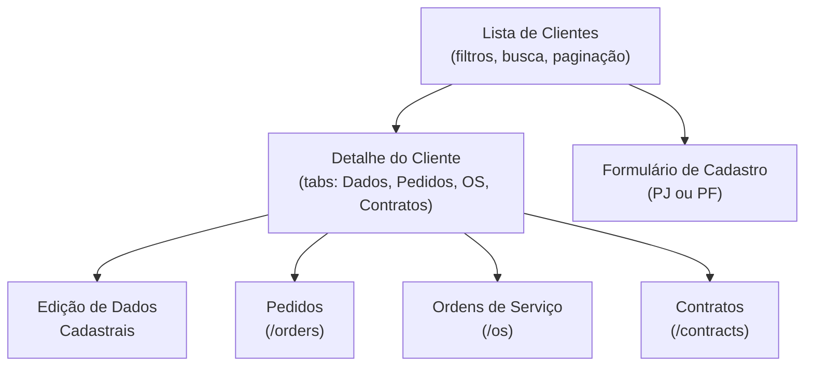

# Módulo: Clientes (Companies)

> **Rota:** `/companies` | **Módulo ID:** `companies` | **Ícone:** `building-2`

## Responsabilidade

Ponto de entrada do CRM para gestão de carteira de clientes. Consolida em uma única tela empresas (PJ) e pessoas físicas (PF) cadastradas, permitindo acesso rápido a pedidos, OS, contratos e histórico vinculados a cada cliente.

---

## Padrão Arquitetural

**Repository Pattern via API REST** — `CompanyService` consome endpoints da API backend e expõe observables para os componentes. Sem estado local persistido; os dados são carregados sob demanda com paginação.

---

## Entidades Relacionadas

| Entidade | Relação | Descrição |
|---|---|---|
| `Empresa` | Principal | Pessoa jurídica com CNPJ, razão social, segmento |
| `PessoaFisica` | Alternativa | Cliente PF com dados de identificação |
| `Contato` | 1-to-many | Pessoas de contato dentro da empresa |
| `Pedido` | 1-to-many | Pedidos comerciais vinculados |
| `OrdemServico` | 1-to-many | OS abertas para o cliente |
| `Contrato` | 1-to-many | Contratos ativos |
| `Lead` | M2O | Lead de origem (se convertido) |

---

## Fluxo Principal

---

## Pontos Fortes

- ✅ Visão unificada de PJ e PF em interface única
- ✅ Navegação contextual — clica no cliente e acessa todos os seus registros
- ✅ Vínculo com CRM para rastrear origem do cliente (lead convertido)

## Sugestões de Melhoria

- 🔧 Busca full-text por razão social, CNPJ e nome fantasia em tempo real
- 🔧 Score de saúde do cliente (pedidos ativos, inadimplência, tempo de relacionamento)
- 🔧 Importação em lote via planilha Excel diretamente na UI

---

## Relevância para Portfolio: ⭐⭐⭐⭐ (4/5)
