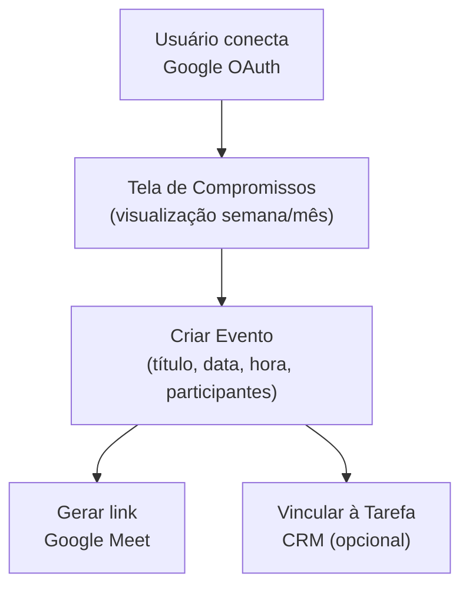

# Módulo: Compromissos

> **Rota:** `/compromissos` | **Condição:** Google integrado | **Ícone:** `calendar`

## Responsabilidade

Visualização e gerenciamento de eventos do Google Calendar do usuário autenticado, diretamente dentro do OcHub. Permite agendar reuniões, criar eventos com link Google Meet e sincronizar compromissos com tarefas do CRM.

---

## Padrão Arquitetural

**Facade Pattern** — `GoogleCalendarService` encapsula toda a comunicação com a Google Calendar API, expondo métodos simplificados (`getEvents`, `createEvent`, `deleteEvent`) para os componentes. O módulo não acessa a API Google diretamente — passa sempre pelo serviço core.

**Condicional de acesso:** só aparece na navbar quando `perms.hasGoogleEnabled()` retorna `true`, verificando se o usuário completou o fluxo OAuth Google.

---

## Entidades Relacionadas

| Entidade | Relação | Descrição |
|---|---|---|
| `GoogleEvent` | Principal | Evento do Google Calendar (título, data, duração, participantes) |
| `CrmTask` | Opcional | Tarefas com `is_meeting: true` e `google_event_id` vinculado |
| `GoogleMeetLink` | Gerado | Link de videoconferência associado ao evento |

---

## Fluxo Principal

---

## Dependências Core

- `google-auth.service.ts` — autenticação e renovação de token
- `google-calendar.service.ts` — operações de evento
- `google-meet.service` — geração de links de reunião

---

## Pontos Fortes

- ✅ Integração nativa com Google Calendar sem sair do sistema
- ✅ Renovação automática de token — sem logout por expiração
- ✅ Eventos com Meet link integrado facilitam reuniões remotas

## Sugestões de Melhoria

- 🔧 Notificações push quando evento está prestes a começar
- 🔧 Sincronização bidirecional: criar tarefa CRM a partir de evento do Calendar
- 🔧 Visão de disponibilidade de equipe para agendamento sem conflito

---

## Relevância para Portfolio: ⭐⭐⭐⭐ (4/5)
