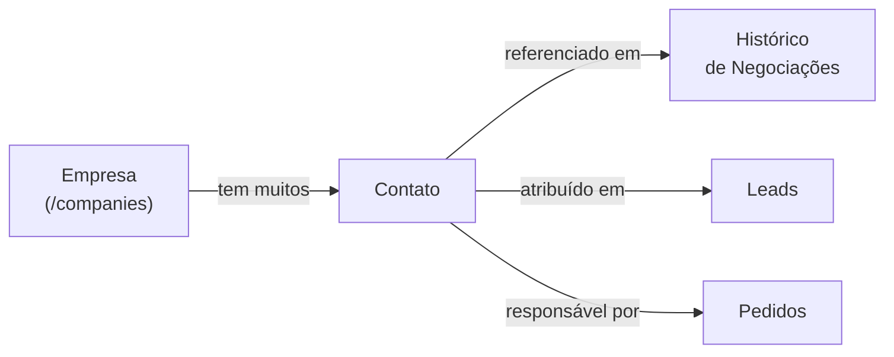

# Módulo: Contatos

> **Rota:** `/contacts` | **Módulo ID:** `contacts` | **Ícone:** `user-plus`

## Responsabilidade

Cadastro de pessoas físicas de contato vinculadas a empresas clientes. Um contato representa o interlocutor humano dentro de uma empresa — o decisor, o técnico ou o usuário final com quem o consultor se relaciona.

---

## Padrão Arquitetural

**Service Layer simples** — `ContactsService` expõe CRUD via API REST. Contatos são entidades independentes vinculadas opcionalmente a uma empresa (`empresa_id`).

---

## Entidades

| Campo | Tipo | Descrição |
|---|---|---|
| `id` | string | Identificador |
| `nome` | string | Nome completo |
| `cargo` | string | Cargo na empresa |
| `email` | string | E-mail de contato |
| `telefone` | string | Telefone (mascarado na UI) |
| `empresa_id` | string | Empresa vinculada |
| `ativo` | boolean | Status do contato |
| `observacoes` | string | Notas do relacionamento |

---

## Relação com Outros Módulos

---

## Pontos Fortes

- ✅ Separação clara entre empresa (PJ) e pessoa de contato
- ✅ Múltiplos contatos por empresa com papéis distintos
- ✅ Reutilizável em leads, histórico e pedidos

## Sugestões de Melhoria

- 🔧 Integração com LinkedIn para enriquecimento automático de perfil
- 🔧 Deduplicação automática por e-mail ao cadastrar novo contato
- 🔧 Campo de preferência de contato (e-mail, telefone, WhatsApp)

---

## Relevância para Portfolio: ⭐⭐⭐ (3/5)
