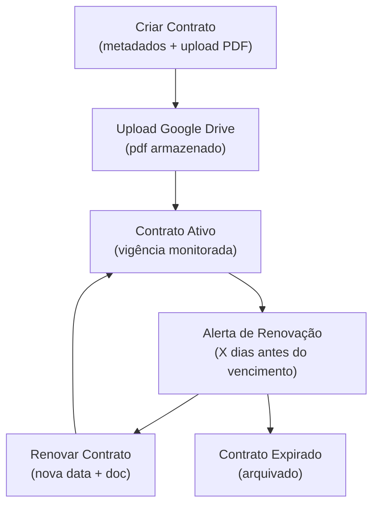

# Módulo: Contratos

> **Rota:** `/contracts` | **Módulo ID:** `contracts` | **Ícone:** `file-signature`

## Responsabilidade

Gestão e armazenamento de contratos comerciais firmados com clientes e parceiros. Centraliza documentos contratuais, datas de vigência, condições e status de renovação em um repositório único com rastreabilidade.

---

## Padrão Arquitetural

**Document Repository Pattern** — `ContractsService` gerencia upload, consulta e atualização de contratos. Documentos físicos (PDFs) são armazenados via integração com Google Drive, enquanto metadados ficam na API backend.

---

## Entidades

| Campo | Tipo | Descrição |
|---|---|---|
| `id` | string | Identificador |
| `titulo` | string | Nome do contrato |
| `cliente_id` | string | Cliente vinculado |
| `parceiro_id` | string | Parceiro vinculado (se aplicável) |
| `status` | enum | ativo, expirado, renovacao_pendente, cancelado |
| `data_inicio` | string | Início da vigência |
| `data_fim` | string | Fim da vigência |
| `drive_file_id` | string | ID do arquivo no Google Drive |
| `valor` | number | Valor contratual |

---

## Fluxo Principal

---

## Pontos Fortes

- ✅ Armazenamento integrado com Google Drive — sem servidor de arquivos próprio
- ✅ Controle de vigência com status automático
- ✅ Vinculação a cliente ou parceiro para rastreabilidade

## Sugestões de Melhoria

- 🔧 Alertas automáticos N dias antes do vencimento via e-mail
- 🔧 Assinatura digital integrada (ex: DocuSign ou similar)
- 🔧 Versionamento de contratos com histórico de revisões

---

## Relevância para Portfolio: ⭐⭐⭐ (3/5)
