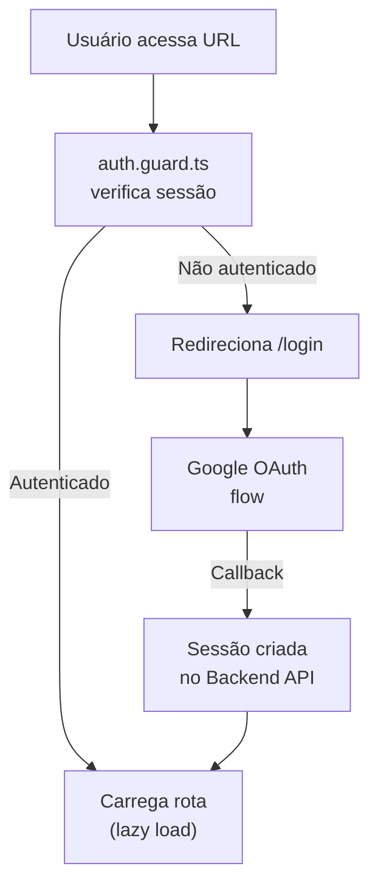

# Módulo: Core (Infraestrutura Angular)

## Overview

O módulo Core (`src/app/core/`) contém a infraestrutura transversal da aplicação Angular: guards de rota, interceptors HTTP, layout principal, serviços de estado global e utilitários compartilhados. É o alicerce sobre o qual todos os módulos de feature são construídos.

**Por que existe:** Centralizar responsabilidades cross-cutting (autenticação, logging, tratamento de erros, layout) evita duplicação e garante comportamento consistente em toda a aplicação.

---

## Componentes do Core

| Componente | Tipo | Responsabilidade |
|---|---|---|
| `auth.guard.ts` | guard | Protege rotas autenticadas, redireciona para `/login` se não autenticado |
| `global-error.interceptor.ts` | interceptor | Captura erros HTTP globalmente, formata e registra |
| `MainLayoutComponent` | component | Shell da aplicação (sidebar + navbar + router-outlet) |
| `permissions.service.ts` | service | RBAC — controla acesso a features por role do usuário |
| `google-auth.service.ts` | service | Autenticação via Google OAuth 2.0 |
| `logger.service.ts` | service | Sistema de logging estruturado com persistência |
| `debug-logger.service.ts` | service | Logger detalhado para debugging em desenvolvimento |
| `navigation-perf.service.ts` | service | Métricas de performance de navegação entre rotas |
| `router-navigation-loading.service.ts` | service | Estado de loading global durante navegação |
| `global-loading.service.ts` | service | Estado de loading para operações assíncronas |
| `notification.service.ts` | service | Sistema de notificações toast |
| `theme.service.ts` | service | Gerenciamento de tema claro/escuro |
| `sidebar.service.ts` | service | Estado do sidebar (expandido/colapsado) |
| `navbar-preloading.strategy.ts` | service | Strategy para preload seletivo de módulos marcados como navbar |

---

## Fluxo: Ciclo de Vida de uma Requisição HTTP

```mermaid
flowchart TD
    Componente["Componente Angular\nchama service"] --> Service["Service\n(ex: crm.service.ts)"]
    Service --> HttpClient["Angular HttpClient"]
    HttpClient --> Interceptor["global-error.interceptor\n(injeta headers, captura erros)"]
    Interceptor -->|"Request"| Backend API["Backend API API\n/ api-server.js"]
    Backend API -->|"Response"| Interceptor
    Interceptor -->|"Erro HTTP"| ErrorHandler["Trata erro\nnotificação + log"]
    Interceptor -->|"Sucesso"| Service
    Service --> Componente
```

---

## Fluxo: Autenticação e Guard



---

## Padrão Arquitetural

**Functional Guards + Injectable Services** — Seguindo Angular 17+ moderno, os guards são funções puras (`authGuard`) ao invés de classes, alinhado com o paradigma de standalone components. Os services são injetados via DI hierárquica.

---

## Pontos Fortes

- ✅ Logging estruturado com persistência — não apenas `console.log`
- ✅ Strategy de preloading seletivo (apenas rotas marcadas com `preload: 'navbar'` são pré-carregadas)
- ✅ Métricas de performance de navegação coletadas automaticamente

---

## Sugestões de Melhoria

- 🔧 Implementar circuit breaker no interceptor para endpoints com falhas repetidas
- 🔧 Adicionar correlation ID às requisições para rastreabilidade fim-a-fim nos logs
- 🔧 Sistema de permissões poderia usar signals para reatividade mais eficiente

---

## Relevância para Portfolio: ⭐⭐⭐⭐ (4/5)

Infraestrutura Angular bem estruturada demonstrando conhecimento de padrões modernos: functional guards, HTTP interceptors, lazy loading com strategy customizada e logging estruturado.
