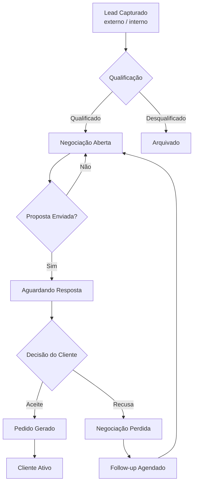
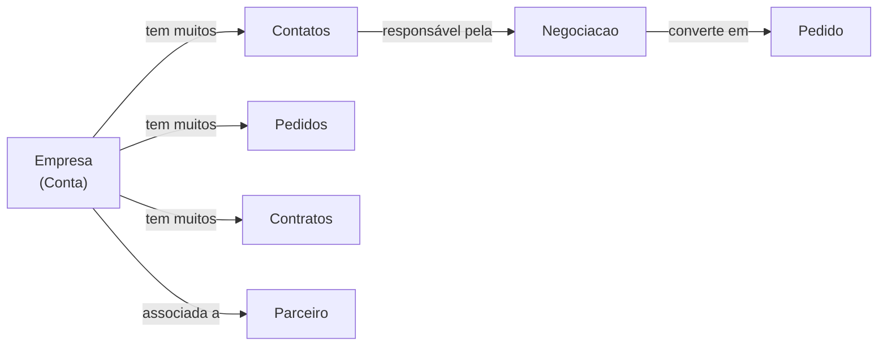

# Módulo: CRM

## Overview

O módulo CRM é o núcleo operacional do OcHub. Gerencia o relacionamento com clientes empresariais e pessoas físicas, rastreando o ciclo de vida desde o primeiro contato (lead) até a fidelização, passando por negociações, contratos e histórico de interações.

**Por que existe:** Antes do OcHub, as distribuidoras gerenciavam carteiras de clientes em planilhas Excel descentralizadas, sem histórico unificado nem rastreabilidade de oportunidades. O módulo CRM centraliza essa operação em tempo real.

---

## Entidades Principais

| Entidade | Tipo | Atributos Públicos |
|---|---|---|
| `Empresa` | model | razao_social, nome_fantasia, segmento, cidade, estado, status |
| `Contato` | model | nome, cargo, email, telefone, empresa_id |
| `Lead` | model | origem, status, data_entrada, responsavel_id, empresa_id |
| `Negociacao` | model | titulo, status, valor_estimado, data_abertura, data_fechamento |
| `HistoricoInteracao` | model | tipo, descricao, data, responsavel_id, cliente_id |
| `Parceiro` | model | nome, tipo_parceria, status, segmento |
| `Consultor` | model | nome, especialidade, status, filial_id |

> Campos omitidos por política de segurança: dados pessoais PII (CPF, endereço completo), dados financeiros detalhados, histórico de cobrança.

---

## Fluxo Principal: Ciclo de Vida do Lead

---

## Fluxo: Gestão de Empresas e Contatos

---

## Padrão Arquitetural

**Repository Pattern via API SDK** — Os services Angular consomem endpoints `/items/empresas`, `/items/contatos` etc. diretamente via HTTP. Não há ORM customizado; o Backend API serve como camada de abstração do banco.

---

## Pontos Fortes

- ✅ Modelo de dados rico com relacionamentos entre entidades (empresa → contatos → negociações → pedidos)
- ✅ Histórico de interações rastreável por cliente
- ✅ Filtragem avançada via query params do Backend API (`_filter`, `_sort`, `_limit`)

---

## Sugestões de Melhoria

- 🔧 Adicionar kanban visual para pipeline de vendas (arrastar leads entre estágios)
- 🔧 Webhook para notificações em tempo real quando lead muda de status
- 🔧 Métricas de conversão por consultor e por origem de lead

---

## Relevância para Portfolio: ⭐⭐⭐⭐ (4/5)

Sistema CRM com modelagem de domínio rica, demonstrando capacidade de estruturar sistemas complexos de relacionamento entre entidades em contexto empresarial real.
