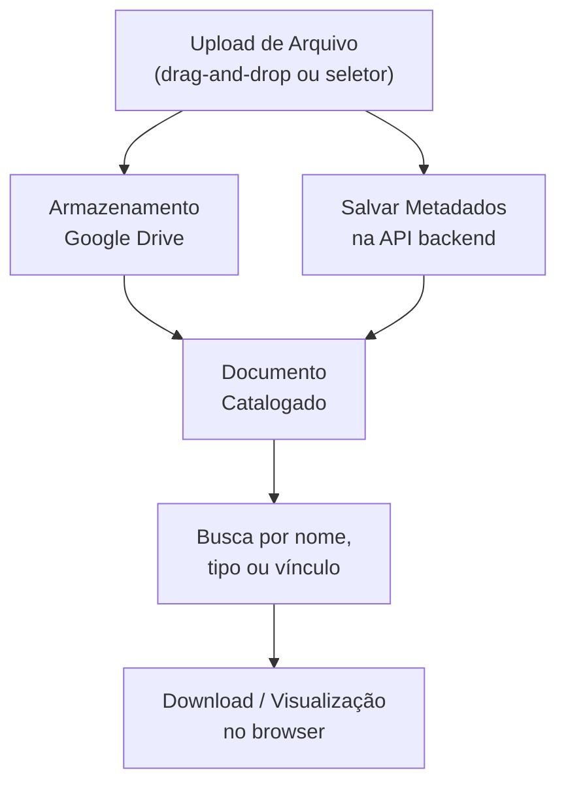

# Módulo: Documentos

> **Rota:** `/documents` | **Módulo ID:** `documents` | **Ícone:** `folder`

## Responsabilidade

Repositório centralizado de documentos vinculados a clientes, pedidos e processos operacionais. Permite upload, categorização, busca e compartilhamento de arquivos relevantes ao negócio, com armazenamento via Google Drive.

---

## Padrão Arquitetural

**Repository + Storage Adapter** — `DocumentsService` abstrai o upload para Google Drive e mantém os metadados (nome, tipo, vínculo, data) na API backend. O frontend nunca acessa o storage diretamente.

---

## Entidades

| Campo | Tipo | Descrição |
|---|---|---|
| `id` | string | Identificador |
| `nome` | string | Nome do documento |
| `tipo` | string | Categoria (nota fiscal, comprovante, proposta, etc.) |
| `cliente_id` | string | Cliente vinculado (opcional) |
| `pedido_id` | string | Pedido vinculado (opcional) |
| `drive_file_id` | string | Referência no Google Drive |
| `url_publica` | string | Link de acesso |
| `date_created` | string | Data de upload |
| `user_created` | string | Usuário que fez upload |

---

## Fluxo Principal

---

## Pontos Fortes

- ✅ Armazenamento delegado ao Google Drive — sem custo de infraestrutura própria
- ✅ Vinculação contextual a cliente ou pedido para recuperação rápida
- ✅ Acesso por link direto sem necessidade de download

## Sugestões de Melhoria

- 🔧 Preview inline de PDFs e imagens sem sair do OcHub
- 🔧 Controle de acesso por documento (público, restrito, confidencial)
- 🔧 OCR automático para tornar documentos buscáveis por conteúdo

---

## Relevância para Portfolio: ⭐⭐⭐ (3/5)
