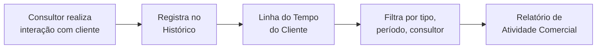

# Módulo: Histórico de Negociações

> **Rota:** `/negotiation-history` | **Módulo ID:** `negotiation-history` | **Ícone:** `history`

## Responsabilidade

Linha do tempo cronológica de todas as interações comerciais realizadas — ligações, reuniões, e-mails, propostas e visitas — vinculadas a clientes e leads. Provê rastreabilidade completa do relacionamento comercial sem depender de memória do consultor.

---

## Padrão Arquitetural

**Append-only Log Pattern** — registros de histórico são imutáveis após criação. Não há edição; apenas adição de novos registros. Listagem em ordem cronológica decrescente com filtros por cliente, consultor e tipo de interação.

---

## Entidades

| Campo | Tipo | Descrição |
|---|---|---|
| `id` | string | Identificador |
| `tipo` | enum | ligacao, reuniao, email, proposta, visita, outro |
| `descricao` | string | Resumo da interação |
| `cliente_id` | string | Cliente relacionado |
| `lead_id` | string | Lead relacionado (opcional) |
| `consultor_id` | string | Consultor que registrou |
| `data_interacao` | string | Data/hora real da interação |
| `date_created` | string | Data do registro no sistema |
| `resultado` | string | Desfecho (positivo, neutro, negativo) |
| `proximo_passo` | string | Ação agendada para o próximo contato |

---

## Fluxo Principal

---

## Pontos Fortes

- ✅ Rastreabilidade total de interações sem dependência de memória
- ✅ Dados de próximo passo integráveis com Compromissos (Calendar)
- ✅ Visão de timeline por cliente facilita passagem de carteira entre consultores

## Sugestões de Melhoria

- 🔧 Gravação automática de interação a partir de eventos do Google Calendar
- 🔧 Análise de frequência de contato por cliente com alertas de inatividade
- 🔧 Exportação de histórico por cliente em PDF para relatórios gerenciais

---

## Relevância para Portfolio: ⭐⭐⭐ (3/5)
