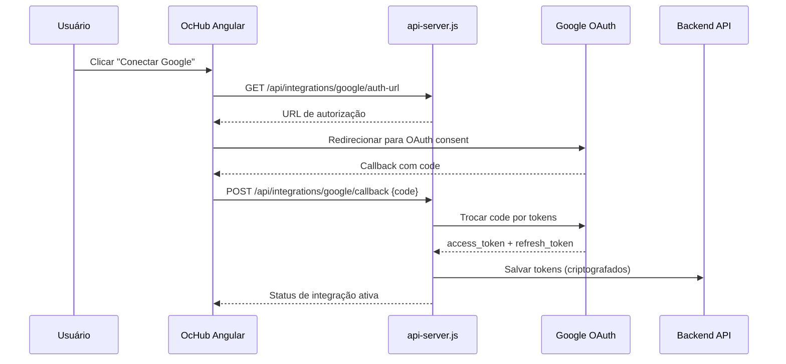
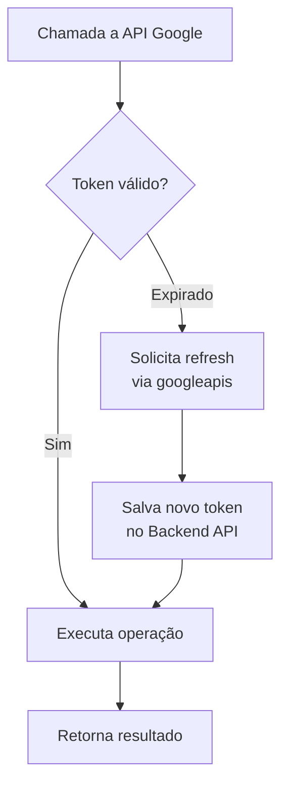

# Módulo: Integrações (integrations)

## Overview

O módulo Integrações centraliza as conexões do OcHub com serviços externos, especialmente o ecossistema Google Workspace. Gerencia tokens OAuth, provê interfaces de configuração e expõe status de cada integração ativa.

**Por que existe:** Diferentes features do OcHub (calendário de compromissos, sincronização de planilhas, armazenamento de documentos) dependem de APIs Google. O módulo centraliza o fluxo de autenticação e refresh de tokens.

---

## Entidades Principais

| Entidade | Tipo | Atributos Públicos |
|---|---|---|
| `IntegracaoGoogle` | model | usuario_id, status, escopos_ativos, data_conexao |
| `CalendarioConfig` | model | calendario_id_publico, nome_exibicao, sincronizado |
| `DriveConfig` | model | pasta_raiz, status_sync |

> Campos omitidos: [OMITIDO] access_token, refresh_token, client_secret — todos redactados por política de segurança.

---

## Fluxo Principal: Google OAuth 2.0

---

## Fluxo: Renovação Automática de Token

---

## Padrão Arquitetural

**Facade Pattern** — O `google-auth.service.ts` e o `google-mirror.service.ts` encapsulam toda a complexidade do OAuth e das APIs Google, expondo métodos simples para os módulos consumidores (Calendar, Drive, Sheets).

---

## Serviços Core Envolvidos

- `google-auth.service.ts` — Gestão de autenticação e tokens
- `google-calendar.service.ts` — Operações de calendário
- `google-drive.service.ts` — Upload e leitura de arquivos
- `google-sheets.service.ts` — Leitura/escrita em planilhas
- `google-mirror.service.ts` — Proxy intermediário para chamadas Google

---

## Pontos Fortes

- ✅ Renovação de token transparente sem logout do usuário
- ✅ Health check específico para o status da integração Google (`GET /api/health`)
- ✅ Diagnóstico detalhado por stage em caso de falha (stage: `users_me` | `integration_lookup`)

---

## Sugestões de Melhoria

- 🔧 Suporte a múltiplos provedores OAuth (Microsoft 365, Slack)
- 🔧 Tela de gerenciamento de escopos ativos com revogação granular
- 🔧 Alertas proativos quando integração está próxima de expirar

---

## Relevância para Portfolio: ⭐⭐⭐⭐ (4/5)

Implementação completa de fluxo OAuth 2.0 com renovação automática de token e múltiplos serviços Google integrados. Padrão comum em produtos SaaS empresariais.
