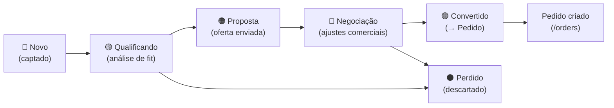
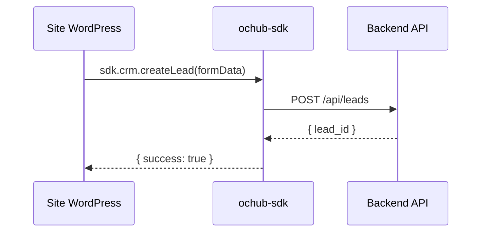

# Módulo: Leads

> **Rota:** `/crm/leads` | **Módulo ID:** `crm.leads` | **Ícone:** `target`

## Responsabilidade

Pipeline de captação e qualificação de oportunidades comerciais. Um lead representa um contato ou empresa com potencial de se tornar cliente. O módulo gerencia o funil completo: desde a entrada do lead (oriundo de sites, formulários ou cadastro manual) até a conversão em pedido ou descarte.

---

## Padrão Arquitetural

**Service Layer + Reactive State** — `CrmService` fornece os métodos de CRUD para leads. O estado do funil é mantido reativamente com signals e observables RxJS.

---

## Entidades

| Campo | Tipo | Descrição |
|---|---|---|
| `id` | string | Identificador |
| `nome` | string | Nome do lead ou empresa |
| `origem` | string | Canal de entrada (site, indicação, evento) |
| `status` | string | Estágio no funil |
| `responsavel_id` | string | Consultor responsável |
| `data_entrada` | string | Data de captação |
| `observacoes` | string | Anotações de qualificação |

---

## Funil de Leads

---

## Integração com SDK (Captura Externa)

Sites WordPress com o plugin OcHub Connector capturam leads e os enviam via SDK:

---

## Funcionalidades do Módulo

- **Listagem com funil visual** — cards por estágio, com contagem e valor estimado
- **Seguimentos (Follow-ups)** — agendamento de próximo contato com histórico
- **Observações** — anotações threaded por lead
- **Conversão** — modal que cria Pedido e Cliente a partir do lead aprovado
- **Histórico de interações** — linha do tempo de todos os contatos realizados

---

## Pontos Fortes

- ✅ Captura automática de leads via SDK de sites parceiros
- ✅ Follow-ups com calendário integrado ao Google Calendar
- ✅ Histórico de interações por lead com linha do tempo

## Sugestões de Melhoria

- 🔧 Lead scoring automático baseado em comportamento (visitas, cliques)
- 🔧 Integração com WhatsApp Business para registro de conversas
- 🔧 Relatório de taxa de conversão por origem de lead

---

## Relevância para Portfolio: ⭐⭐⭐⭐ (4/5)
