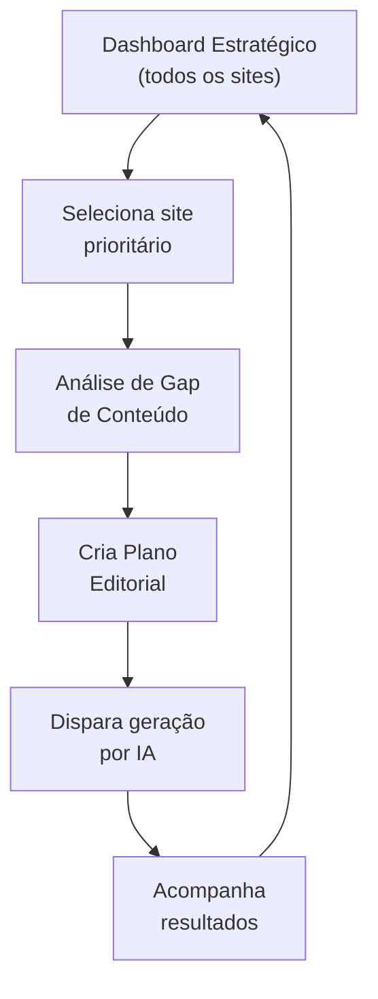

# Módulo: Marketing/SEO Strategist

> **Rota:** `/marketing/seo-strategist` | **Módulo ID:** `marketing.seo-strategist` | **Ícone:** `rocket`

## Responsabilidade

Visão estratégica consolidada de marketing e SEO para o portfólio de sites do grupo. Diferente de "Ferramentas SEO" (análise técnica individual), este módulo oferece uma perspectiva de alto nível: planejamento de campanhas, acompanhamento de posicionamento por site, e recomendações estratégicas geradas com apoio de IA.

---

## Padrão Arquitetural

**Aggregation Dashboard** — combina dados de múltiplas fontes (resultados de auditoria, métricas de publicação, dados de performance de conteúdo) em uma visão única orientada à decisão estratégica.

---

## Funcionalidades

| Funcionalidade | Descrição |
|---|---|
| Visão por site | Score SEO, volume de posts, tendência de posicionamento |
| Planejamento de conteúdo | Definição de pautas e calendário editorial por site |
| Análise competitiva | Comparativo de performance entre sites do portfólio |
| Recomendações de IA | Sugestões de tópicos com base em gaps de conteúdo e tendências |
| Metas de SEO | Definição e acompanhamento de KPIs por site |

---

## Diferença para Ferramentas SEO e Auditoria

| Módulo | Foco |
|---|---|
| **Ferramentas SEO** (`/marketing/seo`) | Análise técnica pontual de URL ou página |
| **Auditoria de Sites** (`/marketing/site-audit`) | Varredura completa do site com histórico |
| **Marketing/SEO** (`/marketing/seo-strategist`) | Visão estratégica do portfólio inteiro + planejamento |

---

## Fluxo de Trabalho do Estrategista

---

## Pontos Fortes

- ✅ Visão consolidada do portfólio inteiro — não site a site
- ✅ Integração com pipeline de IA para execução imediata do plano
- ✅ Planejamento editorial com calendário visual

## Sugestões de Melhoria

- 🔧 Integração com Google Search Console para dados reais de impressões e cliques
- 🔧 Projeção automática de resultado esperado com base no histórico
- 🔧 Briefing gerado por IA a partir do plano editorial para passar ao redator

---

## Relevância para Portfolio: ⭐⭐⭐⭐⭐ (5/5)
