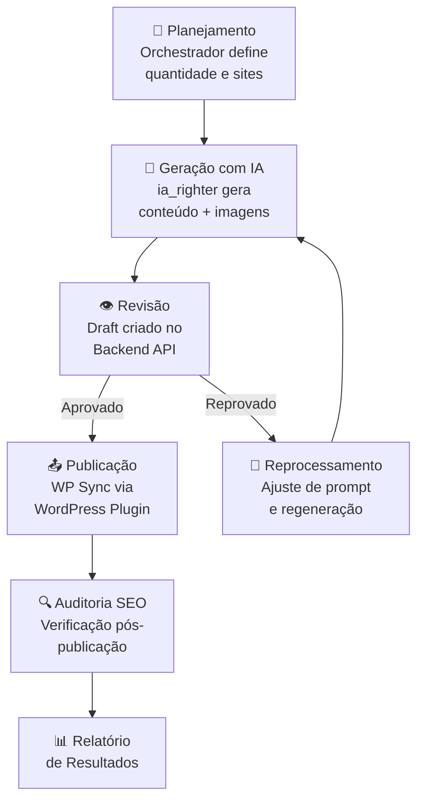
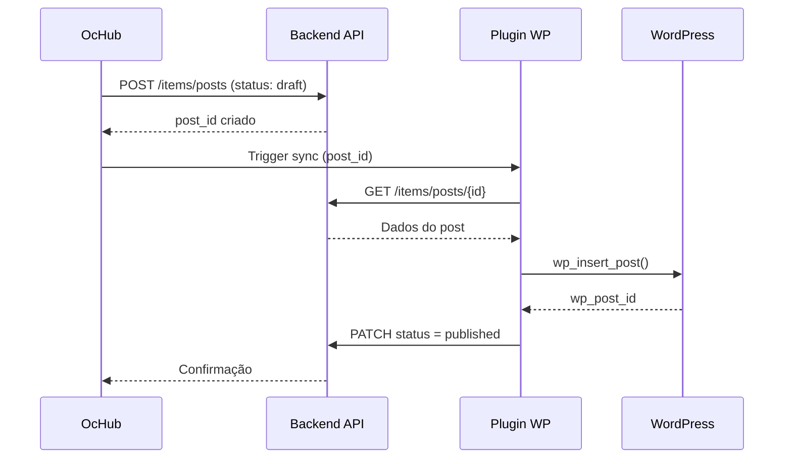

# Módulo: Marketing

## Overview

O módulo Marketing automatiza a produção e publicação de conteúdo editorial em múltiplos sites WordPress gerenciados pelo grupo. Integra um sistema de agendamento, um pipeline de geração de conteúdo com IA e uma ferramenta de auditoria SEO para garantir a qualidade das publicações.

**Por que existe:** A equipe de marketing publicava conteúdo manualmente em cada site WordPress separadamente. Com dezenas de sites no portfólio do grupo, o processo não escalava. O módulo centraliza o planejamento, geração e publicação via automação.

---

## Entidades Principais

| Entidade | Tipo | Atributos Públicos |
|---|---|---|
| `Site` | model | nome, url, categoria, status, operadora_associada |
| `PostAgendado` | model | titulo, status, data_publicacao, site_id, autor_ia |
| `AgendaMarketing` | model | semana, quantidade_posts, sites_alvo |
| `AuditoriaSite` | model | site_id, data, score_seo, urls_analisadas, problemas_encontrados |
| `CampanhaMarketing` | model | nome, objetivo, periodo, sites_alvo, status |

> Campos omitidos: credenciais WordPress por site, resultados de analytics vinculados a dados reais de tráfego.

---

## Fluxo Principal: Pipeline de Publicação Automatizada

---

## Fluxo: Integração com WordPress

---

## Padrão Arquitetural

**Orchestrator + Worker Pattern** — O módulo Angular atua como orquestrador (agenda, monitora status). O `ia_righter` é o worker de geração. O `api-server.js` fornece os endpoints de status e controle via cron jobs.

---

## Pontos Fortes

- ✅ Publicação multi-site a partir de interface única
- ✅ Geração de conteúdo com IA integrada ao pipeline de revisão
- ✅ Auditoria SEO automática pós-publicação com histórico

---

## Sugestões de Melhoria

- 🔧 Dashboard de performance de conteúdo (cliques, tempo na página) por post
- 🔧 A/B testing automatizado para títulos de posts
- 🔧 Recomendação automática de datas ideais de publicação por tópico

---

## Relevância para Portfolio: ⭐⭐⭐⭐⭐ (5/5)

Pipeline end-to-end de automação de marketing com IA, integrando múltiplos sistemas (CMS, WordPress, APIs de imagem). Demonstra capacidade de orquestrar workflows complexos com múltiplos serviços.
