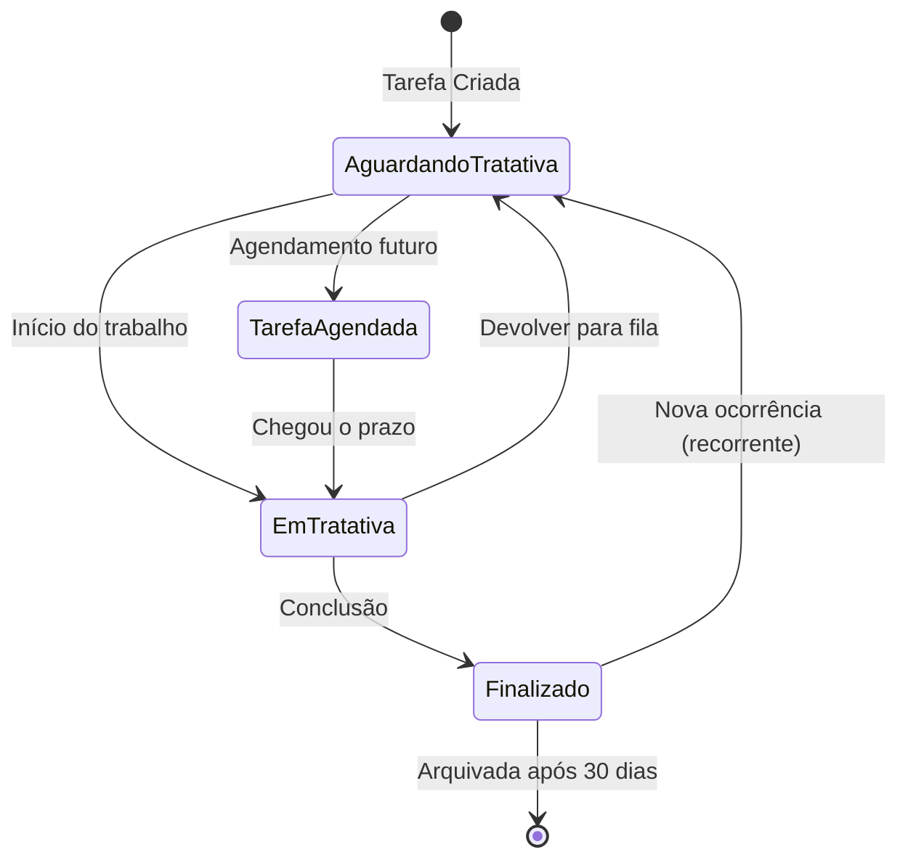
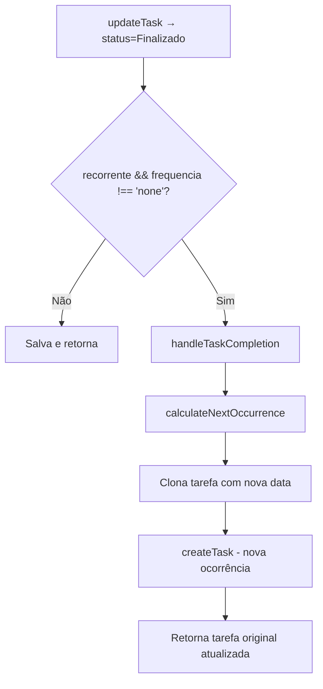

# Módulo: Tarefas — Documentação Completa de Funcionamento e Lógicas

> **Rota:** `/crm` (exact) | **Componente:** [`TasksPageComponent`](file:///Users/calebearaujo/Documents/GitHub/ochub-static-web-microservice/src/app/features/crm/pages/tasks-page/tasks-page.ts) | **Módulo ID navbar:** `crm.tasks`

---

## Visão Geral

A seção Tarefas é o sistema de gestão de atividades internas do OcHub. Permite criar, atribuir, priorizar, filtrar e acompanhar tarefas por múltiplas perspectivas (próprias, de colegas, em atraso, arquivadas), com quatro modos de visualização e lógica avançada de recorrência automática.

---

## Modelo de Dados (`CrmTask`)

```typescript
interface CrmTask {
  // Identificação
  id: string;
  titulo: string;
  descricao?: string;
  observacoes?: string;

  // Status e Prioridade
  status?: TaskStatus;       // 'Aguardando tratativa' | 'Em tratativa' | 'Finalizado' | 'Tarefa agendada'
  prioridade: TaskPriority;  // 'urgent' | 'high' | 'medium' | 'low'

  // Datas
  date_created: string;
  date_updated?: string;
  data_vencimento?: string;   // Due date
  data_conclusao?: string;    // Completion date

  // Autoria e Atribuição
  user_created?: { id, first_name, last_name };     // Criador (M2O)
  responsaveis?: [{ backend_users_id: {...} }];    // Responsáveis (M2M)
  attributed_to?: any;         // Atribuído a (usuário individual)
  attributed_by?: string;      // Quem atribuiu
  attributed_at?: string;      // Quando foi atribuído
  assignment_status?: 'pending' | 'accepted' | 'rejected';
  attributed_team?: string | { id, name };  // Time atribuído

  // Relacionamentos
  cliente_id?: string;          // Cliente vinculado (M2O expandido)
  adesivos?: CrmTaskAdesivo[];  // Etiquetas coloridas (M2M)
  comentarios?: CrmTaskComment[]; // Comentários (1-to-many)
  todo_items?: CrmTaskTodoItem[]; // Checklist (1-to-many)
  todo_progress?: number;         // % conclusão do checklist (0-100, cached)

  // Recorrência
  recorrente?: boolean;
  frequencia_recorrencia?: 'daily' | 'weekly' | 'monthly' | 'every_2_months'
                           | 'every_3_months' | 'every_9_months' | 'yearly' | 'none';
  proxima_recorrencia?: string;    // Próxima data calculada
  recurrence_time?: string;        // Hora do dia
  recurrence_weekday?: string | string[]; // Dia(s) da semana (weekly)
  recurrence_monthday?: number;    // Dia do mês (monthly)

  // Google Integration
  google_event_id?: string;
  google_meet_link?: string;
  is_meeting?: boolean;

  // Transferência
  transferred_from?: string;
  transferred_to?: string;
  transfer_notes?: string;
  transferred_at?: string;
  transferred_by?: string;

  // Estado computado
  is_archived?: boolean;  // Calculado na view (não vem do banco)
}
```

---

## Estados e Fluxo de Status



### Regra de Arquivamento Automático

Uma tarefa é considerada **arquivada** quando:
1. `is_archived === true` (campo explícito), **OU**
2. `status === 'Finalizado'` E não for recorrente E a data de referência for **maior que 30 dias atrás**

```typescript
private isArchivedTask(task: CrmTask): boolean {
  if (task.is_archived) return true;
  if (task.recorrente) return false;       // recorrentes nunca arquivam automaticamente
  if (status !== 'finalizado') return false;

  const referenceDate = task.data_conclusao || task.date_updated || task.date_created;
  const archivedAt = new Date(referenceDate);
  archivedAt.setDate(archivedAt.getDate() + 30);
  return archivedAt < new Date();           // arquivada se passou 30 dias
}
```

---

## Tabs de Visão (Perspectivas)

| Tab | Tipo | Fonte de Dados | Condição de Acesso |
|---|---|---|---|
| **Minhas Tarefas** | `my-tasks` | `allTasks` (filtrado por usuário) | Todos |
| **Acompanhamento em Tempo Real** | `monitoring` | `monitoringTasks` (TODAS as tarefas) | `user.tags.includes('monitor:tasks')` |
| **Visão da Equipe** | `colleagues` | `colleaguesTasks` (tarefas dos colegas) | `user.tags` com `view_user:UUID` |
| **Tarefas em Atraso** | `overdue` | `overdueTasks` (computed de `allTasks`) | Só aparece se houver tarefas atrasadas |
| **Arquivadas** | `archived` | `allTasks` filtradas por `is_archived` | Todos |

### Lógica de Permissão por Tag

```typescript
// Monitoring: verifica tag específica
hasMonitoringPermission = computed(() =>
  user?.tags?.includes('monitor:tasks') || false
);

// Colleagues: verifica tags 'view_user:UUID'
hasColleaguesPermission = computed(() =>
  (user?.tags?.filter(t => t.startsWith('view_user:')).length || 0) > 0
);

// Colleagues tasks: extrai os UUIDs das tags para filtrar
const viewUsers = user?.tags
  ?.filter(t => t.startsWith('view_user:'))
  .map(t => t.split(':')[1]) || [];
```

---

## Consultas ao Backend (CrmService)

### `getTasks()` — Minhas Tarefas
Filtra no servidor tarefas onde o usuário é:
- **Criador** (`user_created._eq: userId`)
- **Responsável** (`responsaveis.backend_users_id._eq: userId`)
- **Atribuído individualmente** (`attributed_to._eq: userId`)
- **Membro do time atribuído** (`attributed_team.members.backend_user_id._eq: userId`)

```
GET /items/oc_crm_tarefa
  ?fields=[campos expandidos com M2M]
  &filter={"_or":[criador,responsavel,atribuido,time]}
  &sort=-date_created
  &limit=-1
  &_t=[timestamp]  // cache busting
```

### `getAllTasksForMonitoring()` — Acompanhamento
Retorna **todas** as tarefas sem filtro de usuário. Guarda-da via verificação de tag no service (não apenas na UI).

### `getColleaguesTasks(viewUsers)` — Visão da Equipe
Filtra tarefas de usuários específicos:
```
filter: { _or: [
  { user_created: { _in: viewUsers } },
  { responsaveis.backend_users_id: { _in: viewUsers } },
  { attributed_to: { _in: viewUsers } }
]}
```

---

## Pipeline de Filtragem e Ordenação (Computed Signal)

O signal `tasks` aplica uma cadeia de transformações em ordem:

```
allTasks / monitoringTasks / colleaguesTasks / overdueTasks
    ↓
1. Mapeia is_archived para cada task
    ↓
2. Filtra: arquivadas vs. ativas (conforme tab)
    ↓
3. Filtro de Origem (apenas my-tasks, overdue, archived):
   - Criadas por mim
   - Atribuídas a mim
   - Sou responsável
   - Pertence às minhas equipes
   (lógica OR — aparece se bater com QUALQUER filtro ativo)
    ↓
4. Filtro por Responsável (selectedUserFilter)
    ↓
5. Filtro por Criador (selectedMonitoringOriginFilter)
    ↓
6. Filtro por Prioridade (selectedPriorities - Set)
    ↓
7. Filtro por Data de Criação (dStart / dEnd)
    ↓
8. Filtro por Adesivos (selectedStickers - Set)
    ↓
9. Filtro por Times (selectedTeams - Set)
    ↓
10. Ordenação (sortBy + sortDirection)
    ↓
tasks[] finais entregues à view
```

### Lógica de Filtro de Origem (detalhe)

```typescript
// Lógica aditiva (OR): a tarefa aparece se bater com qualquer filtro ativo
let keep = false;
if (showCreated && isCreator) keep = true;
if (showAttributed && isAttributed) keep = true;
if (showResponsible && isResponsible) keep = true;
if (showTeams && isTeamTask) keep = true;
```

Se **todos** os filtros de origem estiverem ativos (padrão), **nenhuma filtragem é aplicada** (mostra tudo).

### Comportamento dos Filtros por Set (Adesivos, Times, Prioridades)

- Se **todos selecionados** → sem filtro (mostra todas)
- Se **nenhum selecionado** → sem filtro também (edge case — mostra todas)
- Se **subconjunto selecionado** → filtra apenas as que têm pelo menos um item do set

---

## Ordenação

| Campo | Valor | Comportamento |
|---|---|---|
| Prioridade | `priority` | Usa mapa: `urgent=4, high=3, medium=2, low=1` |
| Criação | `date_created` | Timestamp numérico |
| Atualização | `date_updated` | Timestamp numérico |

**Modo "Divisores" ativo** (`showDateSeparators`): força ordenação por `data_vencimento` como primário, prioridade como secundário — para agrupar tarefas por prazo na visualização.

---

## Modos de Visualização

| Modo | Componente | Disponível em |
|---|---|---|
| **Kanban** | `KanbanBoardComponent` | Desktop (md+) + Mobile (cards por status) |
| **Lista (Tabela)** | `TaskTableComponent` | Desktop + Mobile (cards) |
| **Semana** | `TaskWeekCalendarComponent` | Desktop |
| **Mês** | `TaskMonthCalendarComponent` | Desktop |

### Kanban Mobile
No mobile, o Kanban vira um seletor de status por chip horizontal + lista de cards filtrada pelo status selecionado (`mobileKanbanTasks`).

---

## Lógica de Tarefas Recorrentes

Quando uma tarefa recorrente (`recorrente: true`) é marcada como **Finalizado**, o `updateTask` intercepta e chama `handleTaskCompletion()`:



### `calculateNextOccurrence` — Frequências Suportadas

| Frequência | Incremento |
|---|---|
| `daily` | +1 dia |
| `weekly` | +7 dias (respeita `recurrence_weekday`) |
| `monthly` | Próximo mês no mesmo dia (respeita `recurrence_monthday`) |
| `every_2_months` | +2 meses |
| `every_3_months` | +3 meses (trimestral) |
| `every_9_months` | +9 meses |
| `yearly` | +1 ano |

### O que é clonado na nova ocorrência

✅ Clonado: título, descrição, observações, prioridade, cliente, time atribuído, atribuído a, adesivos (M2M), responsáveis (M2M), configuração de recorrência, `is_meeting`

🔄 Resetado: `attributed_by`, `attributed_at`, `data_conclusao`, `google_event_id`, `google_meet_link`

🆕 Gerado: nova `data_vencimento`, nova `proxima_recorrencia`, `status = 'Aguardando tratativa'`

---

## Lógica de Transferência de Tarefa

O `transferTask()` executa uma sequência em 4 passos via `switchMap` encadeado:

```
1. GET tarefa original
       ↓
2. PATCH original → status=Finalizado (com nota de transferência)
       ↓
3. POST nova tarefa → para o time destino (copia dados essenciais)
       ↓
4. PATCH original → atualiza `transferred_to = id_nova_tarefa`
       ↓
Retorna { originalTask, newTask }
```

---

## Controles de Display

| Toggle | Signal | Efeito |
|---|---|---|
| **Bolhas** | `showBubbles` | Exibe chips coloridos de prioridade/adesivo nos cards |
| **Divisores** | `showDateSeparators` | Agrupa tasks por data de vencimento com separadores visuais |

---

## Eventos do Componente

| Evento | Origem | Ação |
|---|---|---|
| `onTaskCreated(task)` | `TaskFormComponent` | Prepend na lista + reload |
| `onTaskStatusChanged({task, newStatus})` | `KanbanBoardComponent` | Atualiza task no signal localmente (sem reload) |
| `refreshTasks()` | Vários | Recarrega do servidor |
| `openTaskForm(task?)` | Click em card ou botão + | Abre form em modo criação ou edição |

---

## Coleções de Dados Auxiliares Carregadas

| Dado | Service | Finalidade |
|---|---|---|
| `users` | `UsersService` | Lista de usuários para filtros de responsável/origem |
| `availableStickers` | `StickerService.getStickers()` | Filtro de adesivos |
| `availableTeams` | `TeamsService.teams()` | Filtro de times |

---

## Componentes Filhos Envolvidos

| Componente | Arquivo | Responsabilidade |
|---|---|---|
| `KanbanBoardComponent` | `components/kanban-board/` | Colunas drag-and-drop por status |
| `TaskTableComponent` | `components/task-table/` | Listagem tabular com ordenação |
| `TaskWeekCalendarComponent` | `components/task-week-calendar/` | Calendário semanal |
| `TaskMonthCalendarComponent` | `components/task-month-calendar/` | Calendário mensal |
| `TaskFormComponent` | `components/task-form/` | Modal de criação/edição (todos os campos) |
| `TaskTodoComponent` | `components/task-todo/` | Checklist dentro do form |
| `TaskCommentsComponent` | `components/task-comments/` | Comentários threaded |
| `TaskHistoryComponent` | `components/task-history/` | Histórico de atividade (via Backend API `/activity`) |
| `TaskTransferModalComponent` | `components/task-transfer-modal/` | Modal de transferência entre times |

---

## Performance

- **Medição automática** via `NavigationPerfService`:
  - `beginPageInit` no constructor
  - `beginPageLoad` no primeiro load
  - `completePageLoad` com `resultCount` e `monitoringEnabled`
  - `failPageLoad` em caso de erro
- **Carga inicial única** (`initialLoadMeasured` flag) — evita medir cargas subsequentes de refresh
- **`limit: -1`** no Backend API — carrega todas as tarefas sem paginação (performance depende do volume)
- **Cache busting** com `_t: Date.now()` em todas as queries
