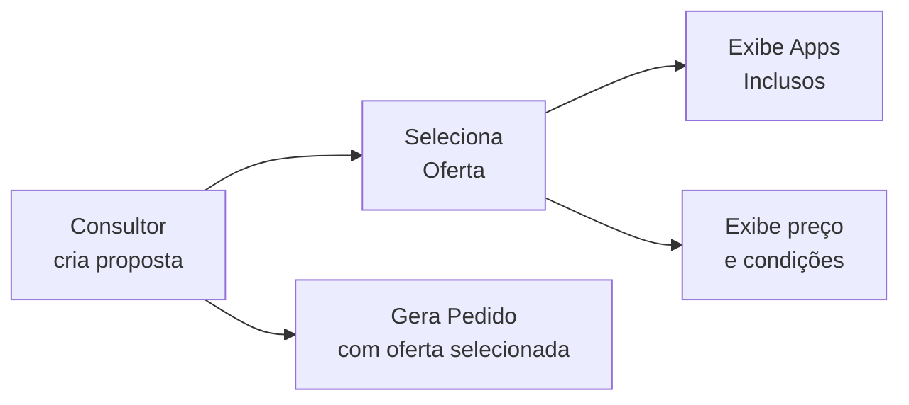

# Módulo: Ofertas

> **Rota:** `/offers` | **Módulo ID:** `offers` | **Sub-rota:** `/offers/apps` (`offers.apps`) | **Ícone:** `tag`

## Responsabilidade

Catálogo de planos e ofertas comerciais disponíveis por operadora. Cada oferta combina um tipo de serviço, uma operadora e condições comerciais (preço, vigência, fidelidade). Usada na composição de propostas e pedidos.

---

## Padrão Arquitetural

**Composite Reference Data** — `OffersService` carrega ofertas compostas por operadora + serviço. O sub-módulo `offers/apps` lista aplicativos e serviços digitais inclusos em determinados planos.

---

## Entidades (Oferta)

| Campo | Tipo | Descrição |
|---|---|---|
| `id` | string | Identificador |
| `nome` | string | Nome comercial da oferta |
| `operadora_id` | string | Operadora que fornece |
| `tipo_servico` | string | Fibra, Móvel, Cloud, etc. |
| `preco` | number | Preço base mensal |
| `fidelidade_meses` | number | Período de fidelidade |
| `descricao` | string | Condições e benefícios |
| `ativo` | boolean | Disponível para proposta |
| `apps` | App[] | Apps inclusos (via sub-rota) |

## Entidades (App — sub-módulo)

| Campo | Tipo | Descrição |
|---|---|---|
| `id` | string | Identificador |
| `nome` | string | Nome do aplicativo |
| `categoria` | string | Streaming, Produtividade, Segurança |
| `icone_url` | string | Ícone do app |
| `ofertas` | string[] | IDs de ofertas onde está incluso |

---

## Uso no Fluxo Comercial

---

## Pontos Fortes

- ✅ Catálogo rico com apps inclusos diferencia o OcHub de simples tabelas de preço
- ✅ Ativo/inativo evita descontinuação brusca — desativa sem deletar histórico
- ✅ Sub-rota de apps com navegação direta pela navbar

## Sugestões de Melhoria

- 🔧 Comparador de ofertas side-by-side para auxílio de escolha pelo consultor
- 🔧 Filtro por disponibilidade por CEP (via API de operadora)
- 🔧 Precificação dinâmica com promoções por período

---

## Relevância para Portfolio: ⭐⭐⭐ (3/5)
