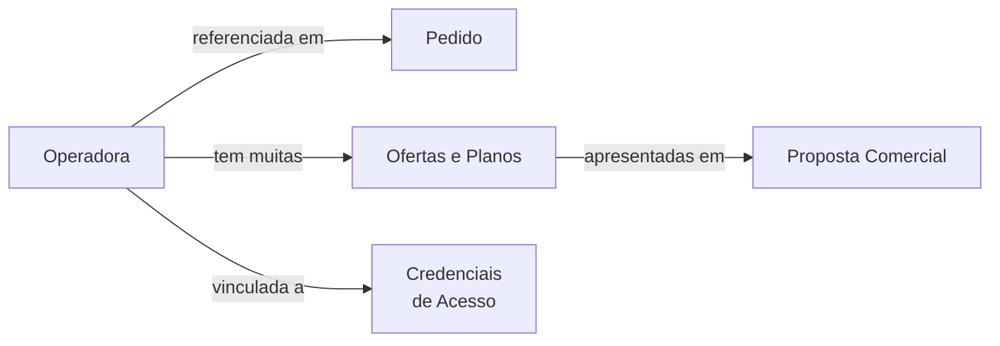

# Módulo: Operadoras

> **Rota:** `/operators` | **Módulo ID:** `operators` | **Ícone:** `radio`

## Responsabilidade

Cadastro de operadoras de telecomunicações parceiras (ex: Vivo, Claro, TIM, Oi) e seus respectivos planos e ofertas. As operadoras são referenciadas em pedidos para identificar qual parceiro prestará o serviço ao cliente final.

---

## Padrão Arquitetural

**Reference Data Pattern** — dados de operadoras são relativamente estáticos e carregados em cache no startup. `OperatorsService` expõe a lista como observable e os componentes de pedido/oferta a consomem como dados de lookup.

---

## Entidades

| Campo | Tipo | Descrição |
|---|---|---|
| `id` | string | Identificador |
| `nome` | string | Nome da operadora |
| `codigo` | string | Código interno de identificação |
| `logo_url` | string | Logo para exibição na UI |
| `ativa` | boolean | Se está ativa para novos pedidos |
| `tipos_servico` | string[] | Ex: fibra, movel, cloud, dados |
| `contato_suporte` | string | Canal de suporte da operadora |

---

## Relação com Outros Módulos

---

## Pontos Fortes

- ✅ Dados de referência centralizados — um update afeta todos os pedidos futuros
- ✅ Logo e dados de suporte disponíveis para componentes de proposta
- ✅ Flag `ativa` para desabilitar operadoras sem deletar histórico

## Sugestões de Melhoria

- 🔧 Integração via API com portais de operadoras para consultar disponibilidade por CEP
- 🔧 SLA por operadora para cálculo de prazo de ativação em pedidos
- 🔧 Avaliação interna de operadoras por desempenho (NPS de parceiro)

---

## Relevância para Portfolio: ⭐⭐ (2/5)
