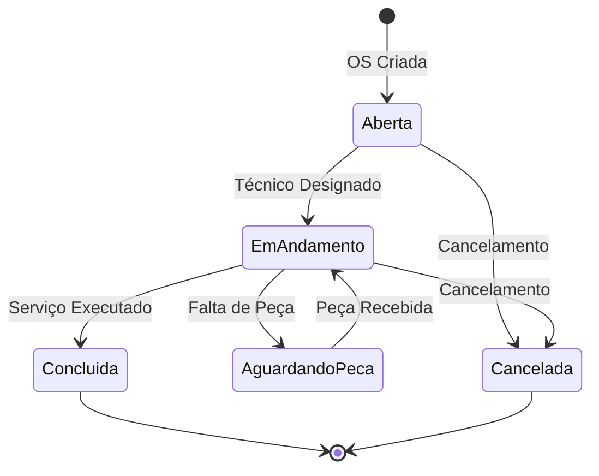
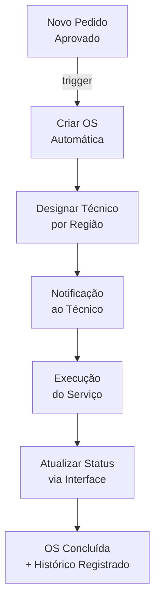

# Módulo: Ordens de Serviço (OS)

## Overview

O módulo OS gerencia o ciclo técnico de atendimento pós-venda. Uma Ordem de Serviço é gerada quando um cliente contratante solicita instalação, manutenção, portabilidade ou cancelamento de um serviço de telecomunicações. O módulo rastreia responsável, status técnico, prazo e histórico de cada atendimento.

**Por que existe:** Ordens de serviço eram gerenciadas manualmente via e-mail e planilha, sem visibilidade do responsável ou do status atual. O módulo centraliza e automatiza o rastreamento operacional.

---

## Entidades Principais

| Entidade | Tipo | Atributos Públicos |
|---|---|---|
| `OrdemServico` | model | numero_os, tipo, status, data_abertura, data_prevista, data_conclusao |
| `TipoOS` | model | nome, descricao, sla_horas |
| `StatusOS` | model | nome, cor, ordem, tipo_final |
| `TecnicoResponsavel` | model | nome, especialidade, filial |
| `HistoricoOS` | model | data, status_anterior, status_novo, observacao |

> Campos omitidos: dados pessoais do cliente final, endereço de instalação, dados de linha telefônica.

---

## Fluxo Principal: Ciclo de Vida da OS

---

## Fluxo: Automação de Status

---

## Padrão Arquitetural

**Service Layer + Backend API REST** — Services Angular fazem operações CRUD via endpoint `/items/ordens_servico`. A lógica de automação de criação de OS a partir de pedidos aprovados fica em `scripts/os-automation-logic.ts`.

---

## Pontos Fortes

- ✅ Rastreamento de histórico de mudanças de status com timestamp
- ✅ Integração com módulo de Pedidos (criação automática de OS)
- ✅ Visualização por filtros: status, técnico, período, tipo

---

## Sugestões de Melhoria

- 🔧 Implementar SLA automático com alertas quando OS exceder prazo
- 🔧 Mapa de calor de OS por região para otimização de equipes técnicas
- 🔧 Integração com agenda do técnico via Google Calendar

---

## Relevância para Portfolio: ⭐⭐⭐⭐ (4/5)

Demonstra modelagem de fluxo de trabalho operacional com máquina de estados explícita e automação de transições, padrões comuns em sistemas ERP e de gestão de campo.
