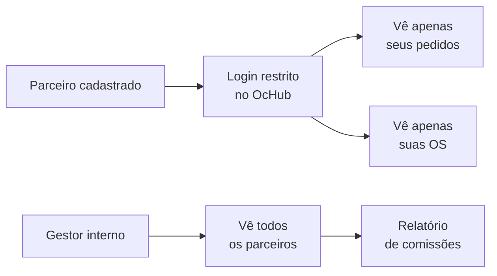

# Módulo: Parceiros

> **Rota:** `/partners` | **Módulo ID:** `partners` | **Ícone:** `handshake`

## Responsabilidade

Cadastro e gestão de empresas parceiras do grupo — revendas, distribuidores e representantes comerciais. Parceiros têm configurações comerciais próprias (comissões, limites de crédito, contratos) e podem ter acesso ao sistema via perfil restrito.

---

## Padrão Arquitetural

**Service Layer + ACL** — `PartnersService` gerencia CRUD de parceiros. O acesso ao módulo é restrito a gestores; parceiros com login próprio enxergam apenas seus dados via perfil isolado.

---

## Entidades

| Campo | Tipo | Descrição |
|---|---|---|
| `id` | string | Identificador |
| `razao_social` | string | Razão social |
| `cnpj` | string | [OMITIDO — dado sensível] |
| `tipo` | enum | revenda, distribuidor, representante |
| `status` | enum | ativo, suspenso, inativo |
| `comissao_pct` | number | Percentual de comissão padrão |
| `limite_credito` | number | Limite de crédito autorizado |
| `gestor_id` | string | Gerente de conta responsável |
| `contrato_id` | string | Contrato vinculado |

---

## Fluxo de Integração Comercial

---

## Pontos Fortes

- ✅ Isolamento de dados por parceiro — cada um vê apenas o que é seu
- ✅ Cálculo de comissão automatizável via campo de percentual
- ✅ Vínculo com contratos para rastreabilidade de acordos comerciais

## Sugestões de Melhoria

- 🔧 Portal de parceiro dedicado com dashboard de comissões e pedidos
- 🔧 Relatório mensal de comissões em PDF gerado automaticamente
- 🔧 Aprovação de pedidos de parceiro com workflow de dupla validação

---

## Relevância para Portfolio: ⭐⭐⭐ (3/5)
