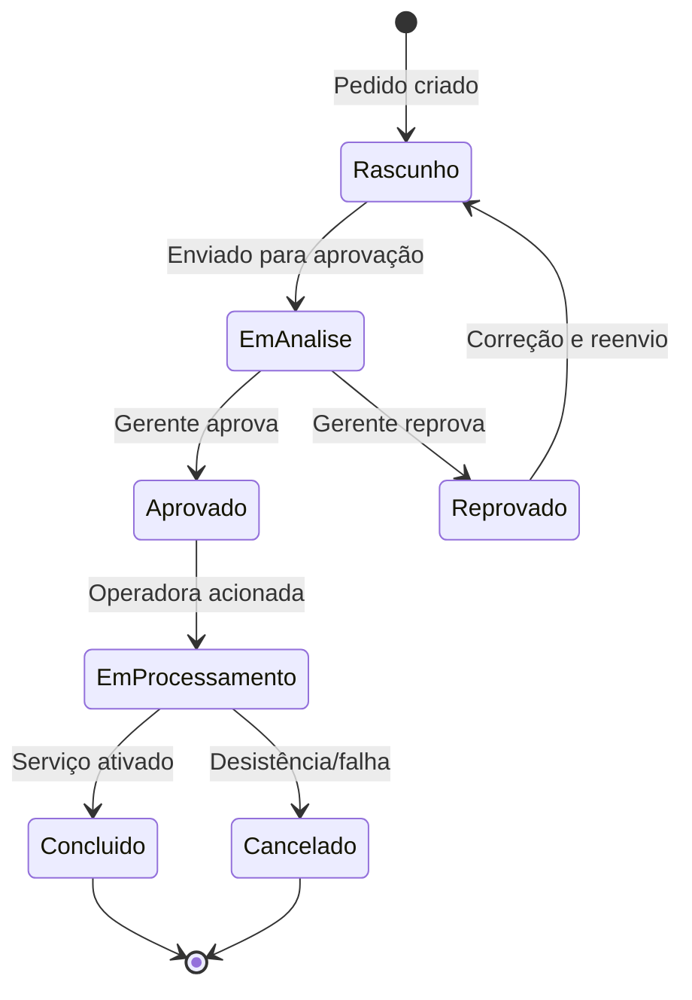
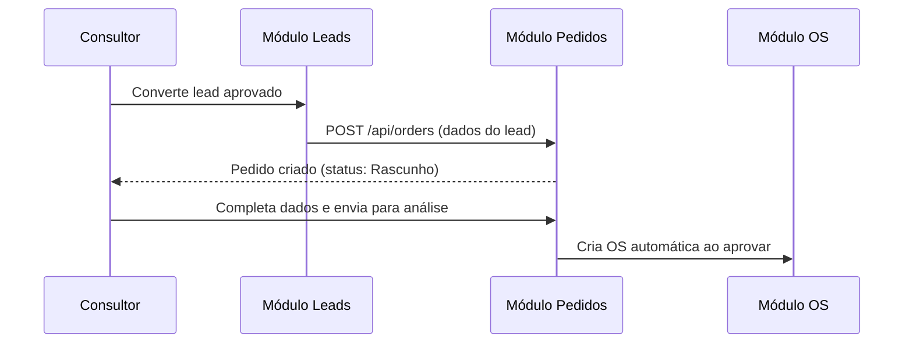

# Módulo: Pedidos

> **Rota:** `/orders` | **Módulo ID:** `orders` | **Ícone:** `package`

## Responsabilidade

Gerencia o ciclo de vida completo de pedidos comerciais — desde a criação (manual ou por conversão de lead) até a conclusão ou cancelamento. Vincula planos contratados, operadoras, consultores responsáveis e clientes em um registro único rastreável.

---

## Padrão Arquitetural

**Service Layer com estado derivado** — `OrdersService` expõe CRUD via API REST. O status do pedido evolui por transições explícitas (não automáticas), com registro de histórico a cada mudança.

---

## Entidades

| Campo | Tipo | Descrição |
|---|---|---|
| `id` | string | Identificador |
| `numero` | string | Número legível (ex: PED-2024-001) |
| `status` | enum | Estágio atual do pedido |
| `cliente_id` | string | Cliente vinculado |
| `consultor_id` | string | Consultor responsável |
| `operadora` | string | Operadora do plano |
| `plano` | string | Plano ou oferta contratada |
| `data_pedido` | string | Data de abertura |
| `data_conclusao` | string | Data de encerramento |

---

## Ciclo de Vida do Pedido

---

## Fluxo: Criação a partir de Lead

---

## Pontos Fortes

- ✅ Rastreabilidade completa — cada mudança de status é logada com autor e timestamp
- ✅ Criação automática de OS quando pedido é aprovado
- ✅ Vínculo com operadora e plano para relatórios por parceiro

## Sugestões de Melhoria

- 🔧 Workflow de aprovação configurável por valor ou tipo de serviço
- 🔧 Notificação automática ao consultor quando status muda
- 🔧 Integração com sistema da operadora para confirmação de ativação

---

## Relevância para Portfolio: ⭐⭐⭐⭐ (4/5)
