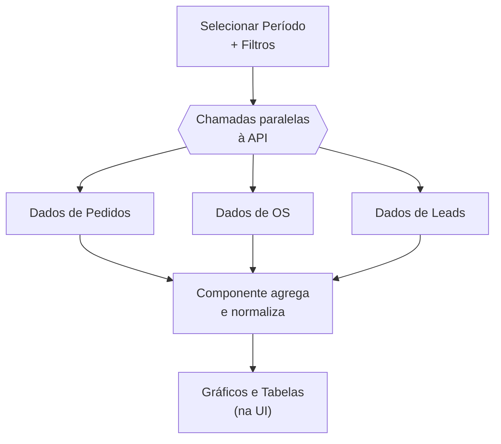

# Módulo: Relatórios

> **Rota:** `/reports` | **Módulo ID:** `reports` | **Ícone:** `bar-chart-2`

## Responsabilidade

Dashboards e relatórios consolidados de performance operacional do grupo. Agrega dados de pedidos, OS, leads e clientes em visualizações gráficas para suporte à tomada de decisão gerencial.

---

## Padrão Arquitetural

**Aggregation Service** — os dados são obtidos via múltiplas chamadas paralelas à API backend e consolidados no componente. Não há endpoint de relatório dedicado; o módulo compõe visões a partir dos recursos existentes.

---

## Tipos de Relatório

| Relatório | Descrição |
|---|---|
| Performance de Vendas | Pedidos por período, por consultor e por operadora |
| Pipeline CRM | Leads por estágio, taxa de conversão, tempo médio de ciclo |
| Ordens de Serviço | OS abertas/concluídas por técnico e por tipo |
| Clientes Ativos | Crescimento da base, segmentação por perfil |
| Marketing | Posts publicados, sites ativos, score SEO médio |

---

## Fluxo de Dados

---

## Pontos Fortes

- ✅ Visão consolidada multi-domínio em interface única
- ✅ Filtros de período e segmento para análise comparativa
- ✅ Exportação de dados para análise externa

## Sugestões de Melhoria

- 🔧 Endpoint dedicado de relatório no backend para reduzir N chamadas paralelas
- 🔧 Relatórios salvos/favoritos por usuário
- 🔧 Alertas automáticos quando métrica cai abaixo de threshold definido

---

## Relevância para Portfolio: ⭐⭐⭐ (3/5)
