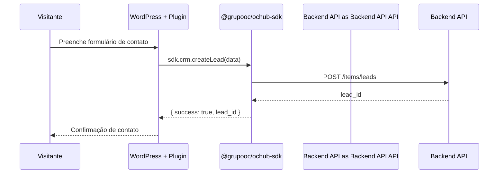

# Módulo: SDK (@grupooc/ochub-sdk)

## Overview

O `@grupooc/ochub-sdk` é uma biblioteca TypeScript publicada como pacote NPM que permite que sistemas externos (como o plugin WordPress) se integrem ao ecossistema OcHub sem acesso direto ao banco de dados ou ao código-fonte da aplicação principal.

**Por que existe:** O grupo opera dezenas de sites WordPress independentes que precisam capturar leads, consultar ofertas e sincronizar dados com o CRM central. O SDK provê essa ponte de forma padronizada e tipada, sem expor a arquitetura interna.

---

## Entidades Exportadas

| Entidade | Tipo | Atributos Públicos |
|---|---|---|
| `OcHubClient` | class | baseUrl, connect(), disconnect() |
| `CrmModule` | module | createLead(), getLead(), updateLead() |
| `CmsModule` | module | getPost(), listPosts(), publishPost() |
| `StaticModule` | module | getOffers(), getSites() |
| `SsgModule` | module | generatePage(), rebuildSite() |

---

## Fluxo: Captura de Lead via SDK (WordPress → OcHub)

---

## Estrutura de Versões

| Versão | Tamanho | Status |
|---|---|---|
| 1.0.2 | ~128 KB | Legado |
| 1.0.3 | ~128 KB | Legado |
| 1.0.6 | ~130 KB | Legado |
| 1.1.0 | ~143 KB | **Atual** |

---

## Padrão Arquitetural

**Facade + Module Pattern** — O SDK expõe um cliente raiz (`OcHubClient`) que instancia módulos especializados (`crm`, `cms`, `static`, `ssg`). Cada módulo encapsula os endpoints do Backend API correspondentes com tipagem TypeScript completa.

---

## Configuração e Build

- **Build tool:** `tsup` (bundle zero-config para TypeScript)
- **Testes:** Vitest
- **Distribuição:** `.tgz` para instalação local ou distribuição manual

---

## Pontos Fortes

- ✅ Tipagem TypeScript completa — erros de integração capturados em tempo de compilação
- ✅ Versionamento semântico com histórico de releases
- ✅ Build otimizado com tsup (tree-shaking automático)

---

## Sugestões de Melhoria

- 🔧 Publicar no registro npm privado em vez de distribuição manual por `.tgz`
- 🔧 Adicionar retry automático com backoff exponencial para resiliência
- 🔧 Documentação de API gerada automaticamente (ex: TypeDoc)

---

## Relevância para Portfolio: ⭐⭐⭐⭐⭐ (5/5)

Desenvolvimento e manutenção de SDK próprio com versionamento semântico e distribuição para sistemas externos. Demonstra maturidade de produto — pensar além do monolito e projetar interfaces públicas estáveis.
