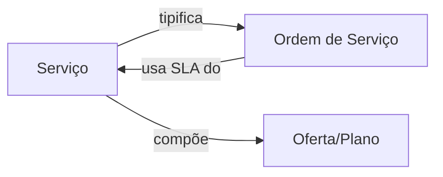

# Módulo: Serviços

> **Rota:** `/services` | **Módulo ID:** `services` | **Ícone:** `wrench`

## Responsabilidade

Catálogo de serviços técnicos oferecidos pelo grupo. Define os tipos de serviço disponíveis (instalação, manutenção, portabilidade, suporte técnico) que são referenciados em Ordens de Serviço e Pedidos.

---

## Padrão Arquitetural

**Reference Data Pattern** — `ServicesService` carrega e disponibiliza o catálogo como dados de referência. A lista é relativamente estática e utilizada como lookup em outros módulos.

---

## Entidades

| Campo | Tipo | Descrição |
|---|---|---|
| `id` | string | Identificador |
| `nome` | string | Nome do serviço |
| `tipo` | string | Categoria (instalação, manutenção, suporte) |
| `descricao` | string | Descrição técnica |
| `sla_horas` | number | Prazo de atendimento em horas |
| `ativo` | boolean | Disponível para novas OS |

---

## Relação com Outros Módulos

---

## Pontos Fortes

- ✅ Catálogo centralizado — mudança de SLA afeta todas as OS futuras
- ✅ Flag `ativo` permite descontinuar serviços sem afetar histórico
- ✅ Tipagem de serviço para filtros em relatórios de OS

## Sugestões de Melhoria

- 🔧 Árvore de categorias para catálogos grandes
- 🔧 Precificação por serviço para composição automática de orçamento
- 🔧 Checklists de execução por tipo de serviço (passos obrigatórios na OS)

---

## Relevância para Portfolio: ⭐⭐ (2/5)
