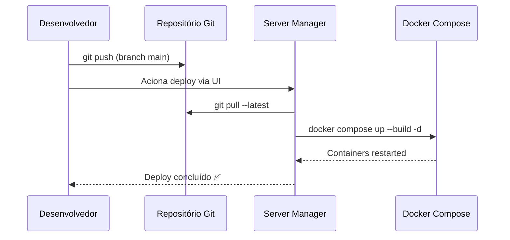

# Módulo: Servidor e Infra (Server Manager)

> **Rota:** `/server-manager` | **Condição:** `canAccess('all')` — apenas Administradores de TI | **Ícone:** `server`

## Responsabilidade

Painel de controle da infraestrutura do OcHub. Permite que administradores de TI visualizem o status dos serviços em execução, gerenciem containers Docker, acompanhem uso de recursos (CPU, RAM, disco) e executem operações de manutenção sem acesso direto ao servidor via SSH.

---

## Padrão Arquitetural

**Admin Dashboard + Backend Proxy** — o `ochub-server-manager` é um container separado (porta 9090) que expõe uma API de controle de infraestrutura. O frontend se comunica com ele via proxy seguro autenticado. Todas as operações destrutivas requerem confirmação dupla.

---

## Funcionalidades

| Funcionalidade | Descrição |
|---|---|
| Status de containers | Visualiza estado de cada container Docker (running, stopped, restarting) |
| Uso de recursos | CPU%, RAM, disco em tempo real por container |
| Logs de container | Tail dos últimos N linhas de cada container |
| Restart de serviço | Reinicia container específico com confirmação |
| Deploy | Aciona pipeline de deploy sem SSH |
| Variáveis de ambiente | Visualiza (sem valores) quais variáveis estão configuradas |

---

## Limites de Memória dos Containers

| Container | RAM Limite | CPU |
|---|---|---|
| `ochub-web` | 1.5 GB | — |
| `ochub-server-manager` | 512 MB | — |
| `ochub-monitor` | 256 MB | — |
| `ochub-ai-agent` | 512 MB | 0.5 vCPU |

---

## Fluxo de Deploy

---

## Controles de Segurança

- ✅ Acesso exclusivo a usuários com role `all` — nenhum outro papel vê esta seção
- ✅ Operações destrutivas (restart, deploy) exigem confirmação modal dupla
- ✅ Todas as ações logadas com autor, timestamp e resultado
- ✅ Valores de variáveis de ambiente nunca expostos na UI

---

## Pontos Fortes

- ✅ Deploy sem SSH — operação acessível para time sem acesso root ao servidor
- ✅ Visibilidade de recursos em tempo real por container
- ✅ Container separado garante que falha no `ochub-web` não derruba o manager

## Sugestões de Melhoria

- 🔧 Alertas automáticos quando RAM ou CPU ultrapassa threshold crítico
- 🔧 Histórico de deploys com rollback automático para versão anterior
- 🔧 Integração com GitHub Actions para deploy via PR aprovado

---

## Relevância para Portfolio: ⭐⭐⭐⭐⭐ (5/5)
