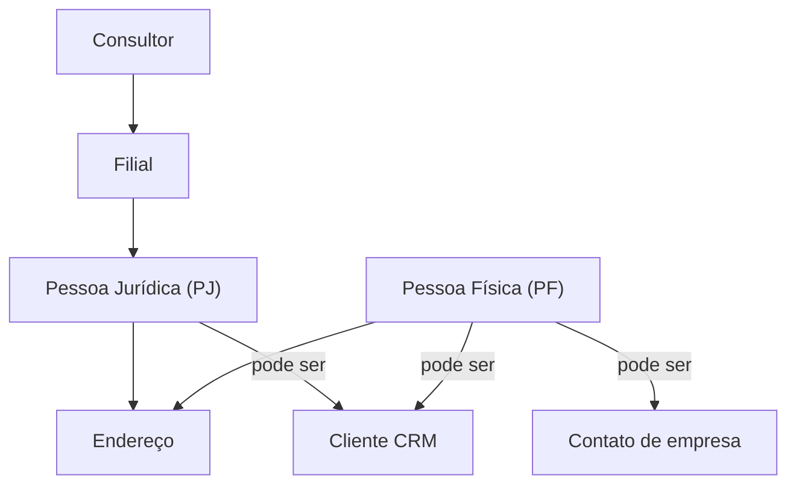

# Módulo: Sistema — Entidades (PJ, PF, Endereços, Filiais)

> **Rotas:** `/entities/pj` | `/entities/pf` | `/entities/addresses` | `/branches`
> **Módulos ID:** `entities.pj` | `entities.pf` | `entities.addresses` | `branches`

## Responsabilidade

Cadastros base do sistema — as entidades fundamentais que sustentam todos os outros módulos. Enquanto "Clientes" é a visão CRM, "Entidades" é a visão cadastral pura: pessoas jurídicas, físicas e endereços como registros independentes que podem ser referenciados por múltiplos contextos.

---

## Padrão Arquitetural

**Entity Repository** — cada entidade tem seu próprio service isolado (`EntitiesService`). As entidades são referenciadas por ID em clientes, contatos, pedidos e OS — não duplicadas.

---

## Entidade: Pessoa Jurídica (PJ)

| Campo | Tipo | Descrição |
|---|---|---|
| `id` | string | Identificador |
| `razao_social` | string | Nome jurídico |
| `nome_fantasia` | string | Nome comercial |
| `cnpj` | string | [OMITIDO] |
| `segmento` | string | Setor de atuação |
| `porte` | enum | micro, pequeno, medio, grande |
| `endereco_id` | string | Endereço vinculado |
| `ativo` | boolean | Status de atividade |

## Entidade: Pessoa Física (PF)

| Campo | Tipo | Descrição |
|---|---|---|
| `id` | string | Identificador |
| `nome` | string | Nome completo |
| `cpf` | string | [OMITIDO] |
| `data_nascimento` | string | [OMITIDO] |
| `email` | string | E-mail |
| `telefone` | string | Telefone (mascarado) |
| `endereco_id` | string | Endereço vinculado |

## Entidade: Endereço

| Campo | Tipo | Descrição |
|---|---|---|
| `id` | string | Identificador |
| `cep` | string | CEP (usado para autopreenchimento) |
| `logradouro` | string | Rua/avenida |
| `numero` | string | Número |
| `complemento` | string | Complemento |
| `bairro` | string | Bairro |
| `cidade` | string | Cidade |
| `estado` | string | UF |

## Entidade: Filial

| Campo | Tipo | Descrição |
|---|---|---|
| `id` | string | Identificador |
| `nome` | string | Nome da filial |
| `cidade` | string | Cidade de atuação |
| `responsavel_id` | string | Gerente responsável |
| `ativa` | boolean | Status de operação |

---

## Relações entre Entidades



---

## Autopreenchimento por CEP

O formulário de endereço integra com a API ViaCEP:
```
GET https://viacep.com.br/ws/{CEP}/json/
→ preenche logradouro, bairro, cidade, estado
```

---

## Pontos Fortes

- ✅ Entidades base reutilizáveis por múltiplos contextos (CRM, OS, Pedidos)
- ✅ Autopreenchimento de endereço por CEP reduz erros de digitação
- ✅ PJ e PF como entidades separadas permitem modelagem correta de ambos os perfis

## Sugestões de Melhoria

- 🔧 Validação de CNPJ/CPF com consulta à Receita Federal
- 🔧 Deduplicação automática de entidades com mesmo documento
- 🔧 Merge de entidades duplicadas com transferência de vínculos

---

## Relevância para Portfolio: ⭐⭐⭐ (3/5)
