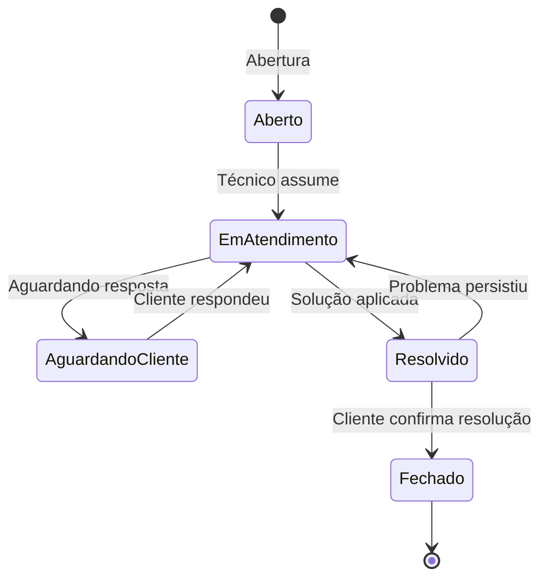

# Módulo: Suporte

> **Rota:** `/support` | **Módulo ID:** `support` | **Ícone:** `headphones`

## Responsabilidade

Central de atendimento e gerenciamento de chamados de suporte técnico. Permite abertura, acompanhamento e resolução de chamados por clientes e técnicos, com SLA monitorado e histórico de atendimento.

---

## Padrão Arquitetural

**Ticket System Pattern** — `SupportService` gerencia o ciclo de vida de chamados. Cada ticket tem status, prioridade, responsável e SLA calculado a partir do tipo de serviço vinculado.

---

## Entidades

| Campo | Tipo | Descrição |
|---|---|---|
| `id` | string | Identificador |
| `numero` | string | Número legível (ex: SUP-2024-001) |
| `titulo` | string | Resumo do problema |
| `descricao` | string | Detalhamento técnico |
| `status` | enum | aberto, em_atendimento, aguardando_cliente, resolvido, fechado |
| `prioridade` | enum | baixa, media, alta, critica |
| `cliente_id` | string | Cliente afetado |
| `tecnico_id` | string | Técnico responsável |
| `servico_id` | string | Tipo de serviço vinculado |
| `sla_prazo` | string | Prazo limite de resolução |
| `data_abertura` | string | Abertura do chamado |
| `data_resolucao` | string | Resolução |

---

## Ciclo de Vida do Chamado

---

## Monitoramento de SLA

- SLA calculado com base em `servico_id.sla_horas`
- Alertas visuais quando chamado está próximo ou acima do prazo
- Relatório de SLA para gestão de qualidade de atendimento

---

## Pontos Fortes

- ✅ SLA automático baseado no catálogo de serviços
- ✅ Histórico de interações por chamado (técnico + cliente)
- ✅ Vinculação a cliente e OS para contexto completo de atendimento

## Sugestões de Melhoria

- 🔧 Canal self-service para clientes abrirem chamados sem login
- 🔧 Chatbot para triagem inicial antes de atribuir ao técnico
- 🔧 Integração com WhatsApp para atualização de status por mensagem

---

## Relevância para Portfolio: ⭐⭐⭐ (3/5)
