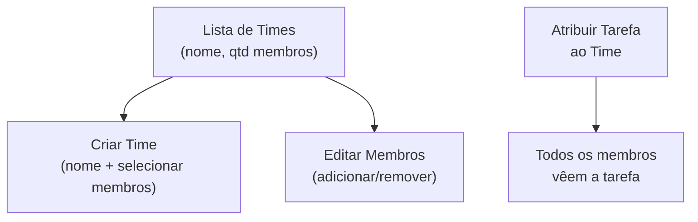

# Módulo: Times (Teams)

> **Rota:** `/crm/teams` | **Módulo ID:** `crm.teams` | **Ícone:** `users`

## Responsabilidade

Gerenciamento de equipes de trabalho que podem receber tarefas coletivas no CRM. Um time agrupa usuários do sistema e pode ser atribuído a tarefas, fazendo com que todos os membros tenham visibilidade e acesso às atividades daquele grupo.

---

## Padrão Arquitetural

**Service + Signal** — `TeamsService` carrega e mantém a lista de times via signal reativo. O estado dos times é compartilhado com `TasksPageComponent` e `TaskFormComponent` sem recargas redundantes.

---

## Entidades

| Entidade | Tipo | Atributos Públicos |
|---|---|---|
| `CrmTeam` | model | id, name, members[] |
| `TeamMember` | model | backend_user_id, role_no_time |

---

## Fluxo Principal



---

## Como os Times afetam as Tarefas

Quando uma tarefa recebe `attributed_team`, o filtro de `getTasks()` na API inclui automaticamente:
```
{ attributed_team: { members: { user_id: { _eq: currentUserId } } } }
```
Isso garante que todos os membros do time vejam a tarefa em "Minhas Tarefas" sem atribuição individual explícita.

---

## Pontos Fortes

- ✅ Atribuição coletiva sem precisar selecionar cada membro individualmente
- ✅ Estado reativo compartilhado entre Times e Tarefas via signal
- ✅ Times usados como filtro na tela de Tarefas

## Sugestões de Melhoria

- 🔧 Roles por time (líder, membro, observador) com permissões diferenciadas
- 🔧 Histórico de tarefas por time com métricas de conclusão
- 🔧 Notificações por time quando nova tarefa for atribuída

---

## Relevância para Portfolio: ⭐⭐⭐ (3/5)
