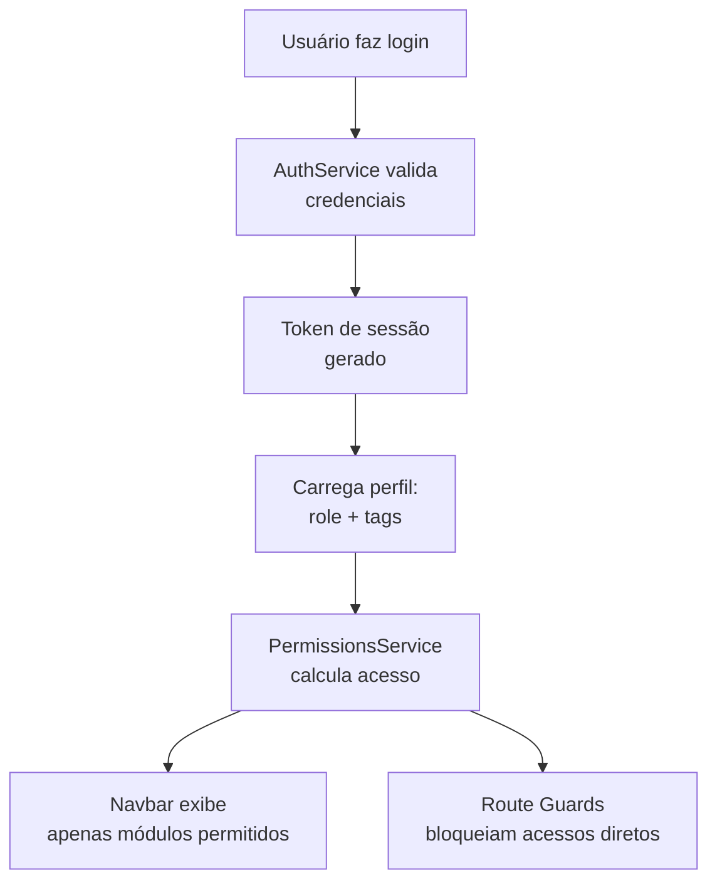

# Módulo: Usuários

> **Rota:** `/users` | **Módulo ID:** `users` | **Ícone:** `shield`

## Responsabilidade

Administração de usuários do OcHub — criação de contas, atribuição de roles, gerenciamento de permissões por módulo e configuração de tags de acesso especial (como `monitor:tasks` e `view_user:UUID`). Módulo restrito a administradores.

---

## Padrão Arquitetural

**RBAC (Role-Based Access Control)** — cada usuário possui um `role` que define acesso padrão aos módulos. Tags adicionais (`tags[]`) concedem permissões granulares além do role. O `PermissionsService` no frontend lê esses dados e controla a visibilidade da navbar e de ações específicas.

---

## Entidades

| Campo | Tipo | Descrição |
|---|---|---|
| `id` | string | UUID do usuário |
| `first_name` | string | Nome |
| `last_name` | string | Sobrenome |
| `email` | string | E-mail de login |
| `role` | object | Role do sistema (id + nome) |
| `tags` | string[] | Permissões granulares extras |
| `status` | enum | active, suspended, invited |
| `avatar` | string | URL do avatar |

---

## Sistema de Tags de Permissão

As `tags` são strings livres com convenções de nomenclatura:

| Tag | Efeito |
|---|---|
| `monitor:tasks` | Acessa aba "Acompanhamento em Tempo Real" em Tarefas |
| `view_user:UUID` | Acessa aba "Visão da Equipe" com tarefas do usuário de UUID |
| `admin:marketing` | Acessa funcionalidades avançadas de marketing |

---

## Fluxo de Acesso

---

## Pontos Fortes

- ✅ Controle granular via tags sem criar roles para cada caso de uso
- ✅ Visibilidade de navbar calculada reativamente — muda sem reload ao alterar permissões
- ✅ Logging automático de mudanças de acesso para auditoria

## Sugestões de Melhoria

- 🔧 UI de gerenciamento de tags com autocomplete das tags disponíveis
- 🔧 Aprovação de novos usuários via workflow de dois administradores
- 🔧 Histórico de login com IP e device para auditoria de segurança

---

## Relevância para Portfolio: ⭐⭐⭐⭐ (4/5)
