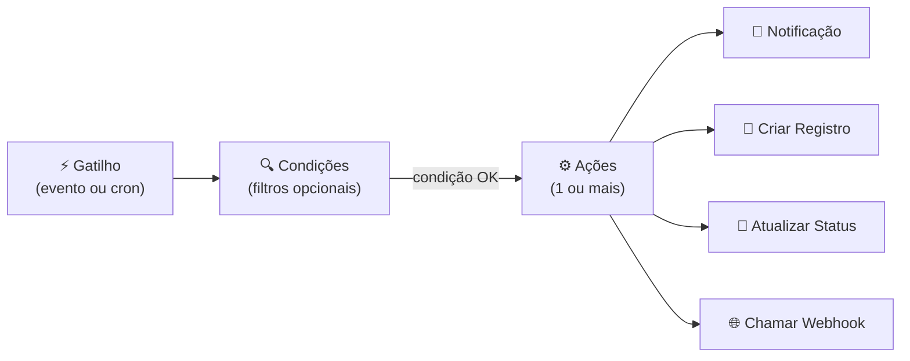

# Módulo: Workflows

> **Rota:** `/workflows` | **Módulo ID:** `workflows` | **Ícone:** `zap`

## Responsabilidade

Configuração e execução de fluxos automatizados de trabalho. Permite que operações repetitivas (notificações, criação automática de registros, atualizações em cascata) sejam orquestradas via regras sem código adicional.

---

## Padrão Arquitetural

**Rule Engine Pattern** — cada workflow é composto por **gatilho** (trigger) + **condições** + **ações**. O motor de execução avalia gatilhos em tempo real (eventos da API) ou em agendamento (cron), aplica as condições e dispara as ações configuradas.

---

## Estrutura de um Workflow

---

## Tipos de Gatilho

| Tipo | Descrição |
|---|---|
| Evento da API | Criação, edição ou exclusão de um registro (ex: pedido criado) |
| Agendado (cron) | Executa em horário fixo (ex: todo dia às 08h) |
| Manual | Disparado por botão na UI |

## Tipos de Ação

| Ação | Descrição |
|---|---|
| Notificação in-app | Cria notificação no centro de notificações |
| E-mail | Envia e-mail para destinatário configurado |
| Criar tarefa | Gera tarefa CRM automaticamente |
| Atualizar campo | Altera campo de um registro |
| Chamar webhook | POST para URL externa |

---

## Exemplos de Uso

- Pedido aprovado → cria OS automaticamente
- Tarefa vencida → notifica responsável
- Todo dia às 09h → verifica leads sem contato há 7 dias → notifica consultor

---

## Pontos Fortes

- ✅ Automação sem código — configurável por usuário com permissão
- ✅ Gatilhos baseados em eventos da API garantem reatividade em tempo real
- ✅ Ações compostas permitem workflows complexos de múltiplos passos

## Sugestões de Melhoria

- 🔧 Editor visual drag-and-drop de fluxos (tipo Zapier/Make)
- 🔧 Log de execução de cada workflow com status e payload
- 🔧 Retry automático para ações que falharam (ex: webhook com timeout)

---

## Relevância para Portfolio: ⭐⭐⭐⭐ (4/5)
